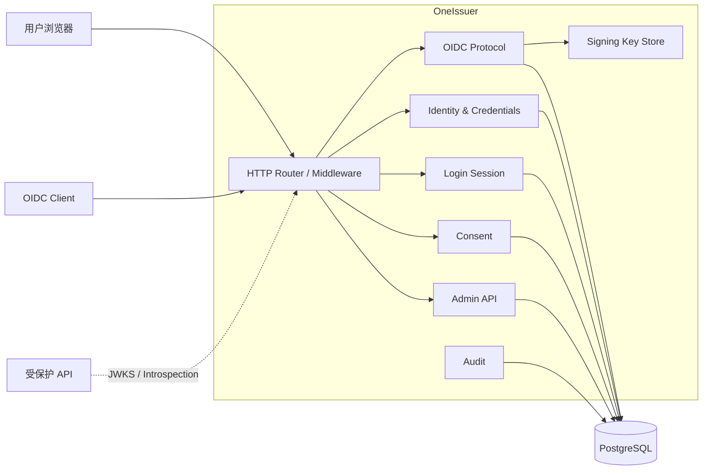
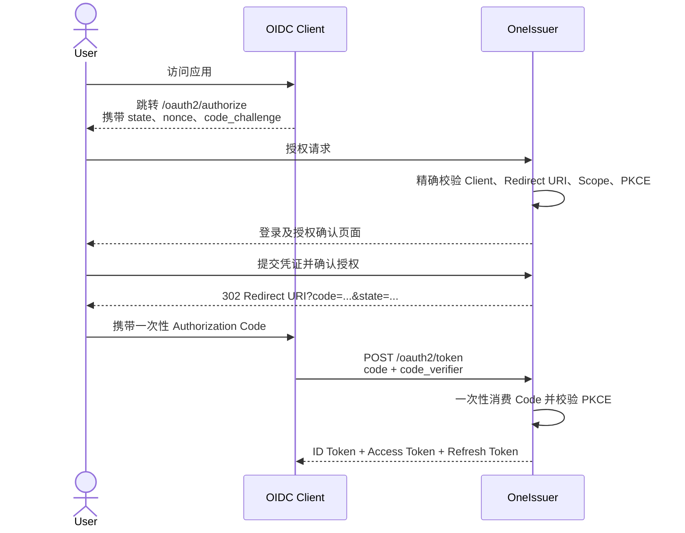
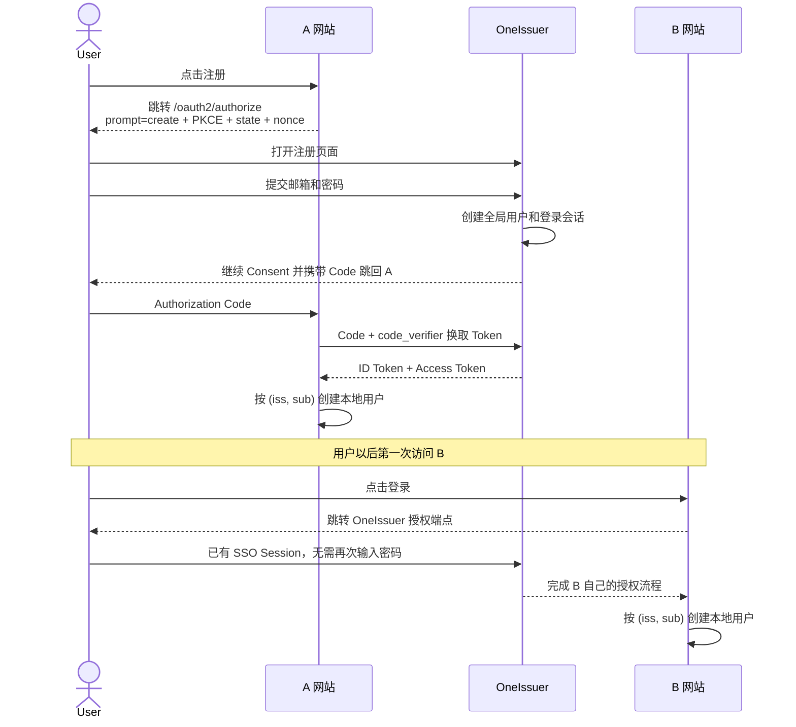

# OneIssuer Go 后端技术方案

> 状态：Draft  
> 适用版本：`v0.1` 规划  
> 项目定位：轻量、自托管、单 Issuer 的 OpenID Connect Provider

## 1. 目标

OneIssuer 为开发者和小型团队提供统一登录能力。一个 OneIssuer 实例只配置一个
`issuer`，所有用户和 OIDC Client 处于同一个安全域中。

首个版本的目标是：

- 正确实现 OIDC Authorization Code Flow + PKCE；
- 提供用户登录、会话、授权确认和退出能力；
- 支持业务网站发起账号注册，注册完成后继续原 OIDC 授权流程；
- 提供用户及 OIDC Client 的基础管理接口；
- 使用 PostgreSQL 持久化，支持 Docker Compose 一键启动；
- 优先保证协议正确性、安全性、可测试性和可维护性；
- 为后续管理控制台、MFA 和第三方登录保留扩展边界。

## 2. 非目标

`v0.1` 明确不实现：

- 多租户、Organization、Realm 隔离；
- SAML、LDAP、SCIM；
- OAuth 2.0 Implicit Flow；
- Resource Owner Password Credentials Grant；
- 细粒度业务权限系统；
- 微服务拆分；
- 自研密码学算法或从零实现完整 OAuth/OIDC 协议栈。

多租户不是当前架构的隐藏开关：数据表不预留无实际语义的 `tenant_id`，避免增加
所有查询、唯一索引和安全校验的复杂度。如果未来决定支持多租户，应作为独立的重大
版本重新设计 Issuer、密钥、用户和 Client 的隔离模型。

## 3. 技术选型

| 领域 | 选型 | 说明 |
| --- | --- | --- |
| 语言 | Go 当前稳定版 | 编译为单个二进制，适合自托管和容器部署 |
| HTTP | `net/http` + `chi` | 保持标准库兼容，只引入轻量路由与中间件 |
| OAuth/OIDC | Ory Fosite | 复用成熟的协议校验、授权流程和 Token 策略 |
| 数据库 | PostgreSQL | 保存用户、Client、会话、授权及 Token 元数据 |
| 数据库驱动 | `pgx/v5` | 原生 PostgreSQL 驱动，性能和类型支持良好 |
| SQL | `sqlc` | 保留显式 SQL，同时生成类型安全的 Go 代码 |
| 数据库迁移 | `goose` | 版本化管理数据库结构 |
| 密码哈希 | `golang.org/x/crypto/argon2` | 使用 Argon2id，不保存或记录明文密码 |
| JWT/JWK | Fosite 配套实现 + `go-jose` | 只使用成熟库完成签名、解析和 JWK 输出 |
| 日志 | 标准库 `log/slog` | 默认 JSON 结构化日志 |
| 指标 | Prometheus client | 暴露登录、Token、错误率和延迟指标 |
| API 描述 | OpenAPI 3 | 描述管理 API，不用它描述浏览器交互页面 |
| 测试 | `testing` + Testcontainers | 单元测试和真实 PostgreSQL 集成测试 |

Fosite 是安全优先的 OAuth 2.0/OIDC 框架，而不是完整的身份产品。它负责协议层的
请求解析、校验和 Token 流程；OneIssuer 仍负责用户登录、Client 管理、授权页面、
持久化、密钥生命周期和审计。

## 4. 总体架构

首个版本采用模块化单体：一个进程、一个 PostgreSQL 数据库、一个 Issuer。



### 4.1 模块边界

- `identity`：用户状态、密码凭证和用户资料；
- `client`：Public/Confidential Client、回调地址和 Scope；
- `session`：浏览器登录会话、重新认证和退出；
- `consent`：授权请求上下文以及用户授权记录；
- `oidc`：Fosite 适配、Discovery、Authorize、Token、UserInfo 等端点；
- `token`：Token 策略、Refresh Token family 和撤销；
- `keystore`：签名密钥加载、轮换和 JWKS 发布；
- `audit`：安全相关事件，禁止写入密码、授权码或完整 Token；
- `admin`：管理员使用的版本化 JSON API；
- `storage/postgres`：上述模块的 PostgreSQL 实现。

模块之间通过明确的用例方法协作。只在数据库、密钥存储、时钟和随机数源等真正的
外部边界定义接口，不为每一个结构体机械地创建接口。

## 5. 建议目录结构

```text
OneIssuer/
├── cmd/
│   └── oneissuer/
│       └── main.go
├── internal/
│   ├── app/                 # 依赖组装、启动与关闭
│   ├── config/              # 环境变量和配置校验
│   ├── httpserver/          # 路由、中间件、错误响应
│   ├── identity/            # 用户与凭证
│   ├── client/              # OIDC Client
│   ├── session/             # 登录会话
│   ├── consent/             # 授权确认
│   ├── oidc/                # OAuth/OIDC 协议适配
│   ├── token/               # Token 生命周期
│   ├── keystore/            # 签名密钥与 JWKS
│   ├── audit/               # 审计事件
│   ├── admin/               # 管理 API
│   └── storage/
│       └── postgres/
├── migrations/
├── queries/                 # sqlc SQL 文件
├── api/
│   └── openapi.yaml
├── web/                     # 登录页与管理控制台，后续加入
├── examples/                # 示例 Client 和 Resource Server
├── deploy/
│   └── docker-compose.yml
├── docs/
├── go.mod
├── sqlc.yaml
├── Dockerfile
└── Makefile
```

Go 的 `internal` 机制可以阻止外部项目直接依赖尚未稳定的内部实现。等核心协议适配或
验证组件形成稳定 API 后，再考虑抽取到 `pkg`；`v0.1` 不提前暴露公共 Go SDK。

## 6. OIDC 协议范围

### 6.1 标准端点

```text
GET  /.well-known/openid-configuration
GET  /oauth2/jwks
GET  /oauth2/authorize
POST /oauth2/token
GET  /oauth2/userinfo
POST /oauth2/userinfo
POST /oauth2/revoke
POST /oauth2/introspect
GET  /oauth2/end-session
POST /oauth2/end-session
```

浏览器交互及内部端点：

```text
GET  /login
POST /login
GET  /register
POST /register
GET  /consent
POST /consent
GET  /health/live
GET  /health/ready
GET  /metrics
```

管理接口统一放在 `/api/admin/v1` 下。Discovery 文档中的所有 URL 必须根据已配置的
Issuer 生成，而不是根据不可信的请求 `Host` 或 `X-Forwarded-Host` 动态拼接。

### 6.2 支持的授权方式

`v0.1` 支持：

- `response_type=code`；
- Authorization Code Grant；
- Refresh Token Grant；
- Public Client 使用 `token_endpoint_auth_method=none`；
- Confidential Client 使用 `client_secret_basic`；
- PKCE 只允许 `S256`，所有 Public Client 强制启用；
- `openid`、`profile`、`email`、`offline_access` Scope；
- OIDC Core 的 `state`、`nonce`、`prompt` 和 `max_age` 基础语义；
- Initiating User Registration via OpenID Connect 的 `prompt=create`；
- `subject_types_supported` 首版只提供 `public` Subject Identifier；
- OIDC RP-Initiated Logout。

不支持明文 PKCE `plain`，不支持模糊或通配符 Redirect URI。

### 6.3 登录流程



### 6.4 业务站点发起用户注册与 JIT Provisioning

用户不需要先主动访问 OneIssuer 官网注册。业务网站可以从自己的“注册”按钮发起
OIDC 授权请求，由 OneIssuer 托管注册表单；注册完成后，OneIssuer 自动创建登录会话
并继续原来的授权流程。

这个能力由两部分组成：

1. **Client-Initiated User Registration**：A 网站发起用户注册，全局账号创建在 OneIssuer；
2. **Just-In-Time Provisioning（JIT）**：A 或 B 第一次收到该用户的有效登录结果时，
   在各自数据库中创建业务侧本地用户。



#### 发起方式

Client 推荐发送：

```http
GET /oauth2/authorize
    ?client_id=site-a
    &redirect_uri=https%3A%2F%2Fa.example.com%2Fcallback
    &response_type=code
    &scope=openid%20profile%20email
    &code_challenge=...
    &code_challenge_method=S256
    &state=...
    &nonce=...
    &prompt=create
```

OneIssuer 在 Discovery 的 `prompt_values_supported` 中声明 `create`。即使 Client 没有
传递 `prompt=create`，登录页面也可以展示“没有账号？创建账号”，并通过服务器保存的
`authorization_request_id` 保留原授权上下文。注册成功后不得跳转到任意前端传入的
`return_to`，而应恢复已校验的授权事务并只跳回已注册的 Redirect URI。

全局配置控制是否开放自助注册，每个 Client 还可以配置是否允许发起注册。注册页面可
展示已经过管理员配置的 Client 名称、Logo 和服务条款链接，但不能接受 Client 在请求
中临时传入的 HTML、Logo URL 或任意文案。

#### 统一身份与业务本地用户

OneIssuer 保存全局身份和凭证，包括稳定的 `sub`、邮箱、密码摘要和登录会话。A、B
网站只保存自己的业务资料、角色、权限和数据。业务网站应使用 `(iss, sub)` 作为外部
身份唯一键，不得只使用可能变化或尚未验证的邮箱关联账号。

业务侧可以采用类似的数据结构：

```sql
CREATE TABLE external_identities (
    id         UUID PRIMARY KEY,
    user_id    UUID NOT NULL,
    issuer     TEXT NOT NULL,
    subject    TEXT NOT NULL,
    created_at TIMESTAMPTZ NOT NULL,
    UNIQUE (issuer, subject)
);
```

Client 收到登录回调后必须验证签名、`iss`、`aud`、`exp`、`nonce` 和授权流程中的
`state`，再按 `(iss, sub)` 查询身份绑定；不存在且本站允许 JIT 时，创建本地用户并
绑定身份。A 获得的 ID Token 的 `aud` 是 A，不能被直接拿给 B 使用；用户访问 B 时，
B 必须发起自己的 OIDC 流程，只是 OneIssuer 的 SSO Session 可以让用户免输密码。

身份认证和业务授权需要保持分离：拥有 OneIssuer 账号不代表自动获得所有 Client 的
访问权限。各网站可以自行采用开放 JIT、仅邀请用户或仅允许已存在用户等策略。
OneIssuer 负责证明“用户是谁”，业务网站负责判断“用户可以做什么”。

#### 安全要求

- 注册页面和密码提交必须由 OneIssuer Origin 托管；
- 不允许 Public Client 通过 API 收集并转交用户密码；
- 注册事务绑定已验证的 Client、Redirect URI、Scope、PKCE、`state` 和 `nonce`；
- 注册、邮件发送及验证码端点分别限流，并预留 CAPTCHA/风控扩展点；
- 创建用户、创建凭证和消费注册事务应在同一数据库事务中完成；
- 用户名和规范化邮箱依靠唯一约束防止并发重复注册；
- 邮箱未验证时只能返回 `email_verified=false`；
- 只按照已授权 Scope 返回 Claim，不因共享账号而向 A、B 自动共享业务数据；
- 注册成功、失败、冲突和异常回跳都写入不包含密码的审计事件。

## 7. Token 设计

### 7.1 Token 类型

| 类型 | 格式 | 建议有效期 | 存储策略 |
| --- | --- | --- | --- |
| Authorization Code | 256-bit 随机不透明字符串 | 1 分钟 | 只保存 SHA-256 摘要，一次性消费 |
| ID Token | RS256 JWT | 5 分钟 | 不保存完整 Token |
| Access Token | RFC 9068 JWT | 10 分钟 | 保存 `jti`、状态及会话关联 |
| Refresh Token | 256-bit 随机不透明字符串 | 30 天 | 只保存摘要，按 family 轮换 |

选择 RS256 作为初始默认算法是为了最大化客户端兼容性。代码必须通过 `KeyStore`
抽象算法和密钥来源，不能把算法名称散落在业务代码中。

### 7.2 Refresh Token 轮换

每次成功刷新后：

1. 将旧 Refresh Token 原子地标记为已使用；
2. 创建同一 `family_id` 下的新 Refresh Token；
3. 如果已使用的旧 Token 再次出现，判定为重放；
4. 撤销整个 Token family，并写入安全审计事件。

并发刷新必须依赖数据库事务和条件更新解决，不能只依靠进程内互斥锁。

### 7.3 Access Token 撤销语义

JWT Access Token 支持 API 通过 JWKS 离线校验，因此撤销信息不会自动传播。默认依靠
较短的 10 分钟有效期限制风险：

- 对即时撤销要求不高的 API，可以离线校验 JWT；
- 对即时撤销要求高的 API，应调用 Introspection Endpoint；
- 撤销 Refresh Token 或登录会话后，不再签发新的 Access Token；
- 文档必须明确说明离线校验带来的最长撤销延迟。

## 8. 数据模型

建议首版包含以下表：

| 表 | 用途 |
| --- | --- |
| `users` | 用户标识、用户名、邮箱、验证状态和资料 |
| `credentials` | Argon2id 密码摘要以及未来的 MFA 凭证 |
| `oidc_clients` | Client ID、类型、认证方式、注册策略、展示信息和状态 |
| `oidc_client_secrets` | Client Secret 摘要、创建及失效时间 |
| `oidc_redirect_uris` | 登录回调地址白名单 |
| `oidc_logout_redirect_uris` | 退出后的回调地址白名单 |
| `oidc_client_scopes` | Client 允许申请的 Scope |
| `login_sessions` | 浏览器登录会话及最近认证时间 |
| `authorization_requests` | 短期授权请求上下文，包括是否进入注册流程 |
| `authorization_codes` | 一次性授权码摘要及 PKCE 信息 |
| `consent_grants` | 用户对 Client 授予的 Scope |
| `access_tokens` | Access Token 的 `jti`、状态和关联关系 |
| `refresh_tokens` | Refresh Token 摘要、family 和轮换状态 |
| `audit_events` | 登录、授权、撤销和管理操作事件 |

所有时间在数据库中使用 `timestamptz`，在 Go 中统一按 UTC 处理。用户、Client 和
会话使用不可猜测的内部 ID；对外稳定身份标识使用 `sub`，不要直接把邮箱作为
`sub`，因为邮箱可能变化。

`oidc_clients.client_id`、用户名以及规范化邮箱需要唯一索引。Redirect URI 单独成表，
并对 `(client_id, redirect_uri)` 建立唯一约束。

## 9. 密钥管理

`v0.1` 使用挂载到容器中的 JWK/PEM 私钥文件：

- 私钥文件权限为 `0600`；
- 私钥不进入 Git、镜像、日志或普通数据库字段；
- 每把密钥包含唯一 `kid`；
- JWKS 同时发布当前密钥和仍处于 Token 验证窗口内的旧公钥；
- 新 Token 只使用当前 Active Key 签名；
- 旧公钥至少保留到其签发的最长生命周期 Token 全部失效。

密钥读取通过 `KeyStore` 接口完成。后续可以增加 Vault、AWS KMS、GCP KMS 等实现，
不改变 OIDC 用例层。项目应提供类似下面的管理命令：

```bash
oneissuer keys generate --alg RS256 --out ./data/signing-key.jwk
```

## 10. 会话与浏览器安全

- 登录 Cookie 仅保存高熵随机 Session ID，不保存用户资料或 Token；
- 数据库只保存 Session ID 的 SHA-256 摘要；
- Cookie 设置 `HttpOnly`、`Secure` 和 `SameSite=Lax`；
- 生产模式不允许关闭 `Secure`，开发模式可为 localhost 显式放宽；
- 登录、授权确认和退出表单使用 CSRF Token；
- 登录成功后轮换 Session ID，防止 Session Fixation；
- Redirect URI 必须与注册值进行标准要求的精确匹配；
- `return_to` 等内部跳转参数只能引用服务器保存的授权事务 ID；
- CORS 按 Client 的可信来源精确配置，禁止 `*` 与凭证组合；
- 只信任显式配置的反向代理，避免伪造 Forwarded Headers；
- 登录、Token 和管理接口分别限流；
- 日志自动过滤密码、Authorization Header、Cookie、Code 和 Token。

密码使用 Argon2id。参数保存在配置中，但需要设置安全下限；登录成功后如果发现旧摘要
参数低于当前标准，可在同一流程中重新哈希。

## 11. 配置

遵循十二要素应用原则，首版主要通过环境变量配置：

```text
ONEISSUER_ISSUER=https://id.example.com
ONEISSUER_HTTP_ADDR=:8080
ONEISSUER_DATABASE_URL=postgres://...
ONEISSUER_SIGNING_KEY_FILE=/run/secrets/signing-key.jwk
ONEISSUER_COOKIE_SECURE=true
ONEISSUER_REGISTRATION_ENABLED=true
ONEISSUER_TRUSTED_PROXIES=10.0.0.0/8
ONEISSUER_LOG_LEVEL=info
```

启动时必须校验：

- Issuer 是规范化的绝对 URL，生产环境使用 HTTPS；
- Issuer 不包含 query 或 fragment；
- 数据库连接可用且迁移版本兼容；
- 签名密钥合法，`kid` 唯一；
- 生产模式所需的安全配置没有被关闭。

配置错误时快速失败，不带着不安全的默认值继续运行。

## 12. 错误处理与审计

协议端点返回标准 OAuth/OIDC 错误，例如 `invalid_request`、`invalid_client`、
`invalid_grant` 和 `invalid_scope`。面向浏览器的 Authorize 错误只有在 Redirect URI 已经
验证可信后才能重定向回 Client，否则直接显示本地错误页。

每个请求生成 `request_id`，日志和审计事件使用该 ID 关联。建议记录：

- 登录成功、失败及锁定；
- 用户自助注册成功、失败、冲突及来源 Client；
- Authorization Code 签发和异常重复消费；
- Refresh Token 重放及 family 撤销；
- Client 创建、修改、Secret 轮换和删除；
- 用户禁用、密码重置和管理员操作；
- 签名密钥激活和退役。

审计日志记录事件和必要元数据，不记录任何可直接使用的凭证。

## 13. 可观测性

### 日志

使用 `slog` 输出 JSON，包括：

```text
timestamp, level, message, request_id, route, method, status, duration
```

对用户名、邮箱、IP 等字段制定明确的隐私策略，默认不记录完整 Token 或认证表单。

### 指标

至少提供：

- HTTP 请求量、状态码和延迟；
- 登录成功/失败计数；
- Authorize、Token、Refresh 请求结果；
- 数据库连接池状态；
- 当前登录会话数量；
- Refresh Token 重放检测次数。

健康检查必须分为：

- `/health/live`：进程是否存活，不访问外部依赖；
- `/health/ready`：数据库、密钥及必要初始化是否就绪。

## 14. 测试策略

### 单元测试

- Redirect URI 精确匹配；
- PKCE S256 正确及错误场景；
- `state`、`nonce`、`aud`、`iss`、`exp` 校验；
- Authorization Code 一次性消费；
- `prompt=create`、注册事务恢复和非法回跳拦截；
- 登录 Session 过期及轮换；
- Refresh Token 正常轮换和重放检测；
- Client Secret 校验；
- Scope 与 Claim 映射。

### 集成测试

使用 Testcontainers 启动真实 PostgreSQL，覆盖：

- 数据库迁移从空库完整执行；
- 完整 Authorization Code + PKCE 流程；
- 从 A 发起注册、回到 A，以及随后通过 SSO 首次登录 B 的流程；
- Client 禁止注册、全局关闭注册及并发重复注册场景；
- Confidential/Public Client；
- Token Refresh、Revoke 和 Introspection；
- 进程重启后 Client、用户和会话行为；
- 并发使用同一个 Code 或 Refresh Token 时只允许一个请求成功。

### 安全和兼容性测试

- 对 URI 解析、Authorize 参数和 JWT Claim 解析增加 Go Fuzz 测试；
- CI 运行 `go test -race ./...`、`go vet ./...` 和 `govulncheck ./...`；
- 发布候选版本接入 OpenID Foundation Conformance Suite；
- 对依赖启用 Dependabot 或 Renovate，并生成 SBOM。

## 15. 开发阶段

### 阶段一：项目基础

- 详细执行计划见 [`phase-1-development-plan.md`](./phase-1-development-plan.md)；
- 初始化 Go Module 和目录结构；
- 配置 PostgreSQL、迁移、sqlc；
- 实现配置校验、结构化日志、健康检查；
- 提供 Dockerfile 和 Docker Compose。

### 阶段二：身份与 Client

- 详细执行计划见 [`phase-2-development-plan.md`](./phase-2-development-plan.md)；
- 用户、密码凭证和登录会话；
- 自助注册、`prompt=create` 和注册后恢复原授权事务；
- OIDC Client、Redirect URI、Scope；
- 管理员初始化命令和基础管理 API；
- 审计事件。

### 阶段三：OIDC 主流程

- 详细执行计划见 [`phase-3-development-plan.md`](./phase-3-development-plan.md)；
- Discovery 和 JWKS；
- Authorize、登录及 Consent；
- Authorization Code + PKCE；
- Token、ID Token、UserInfo；
- 示例 Client 完成端到端登录。

### 阶段四：生命周期与安全

- Refresh Token rotation/reuse detection；
- Revoke、Introspection 和 RP-Initiated Logout；
- 限流、CSRF、安全响应头；
- 集成测试、Fuzz 测试和故障场景测试。

### 阶段五：`v0.1` 发布

- 管理控制台或最小可用管理页面；
- OpenAPI、接入文档和安全说明；
- 多架构容器镜像、SBOM 和 Release Notes；
- 明确标注仍未完成的 Conformance 项目和生产使用限制。

## 16. `v0.1` 验收标准

满足以下条件后再发布 `v0.1.0`：

1. `docker compose -f deploy/docker-compose.yml up` 可以从空数据库启动；
2. 管理员可以创建用户和 Public/Confidential Client；
3. 用户可以从 A 示例应用发起注册，并在注册后自动返回 A 完成登录；
4. 同一用户随后访问 B 示例应用时，可以复用 OneIssuer 会话并完成 B 的 JIT 开户；
5. 示例应用可以完成 Authorization Code + PKCE 登录；
6. Discovery、JWKS、ID Token 中的 Issuer 完全一致；
7. 错误 Redirect URI、错误 PKCE 和重复 Authorization Code 均被拒绝；
8. Refresh Token 轮换及重放检测通过并发集成测试；
9. 私钥、密码、Code 和 Token 不出现在日志中；
10. `go test -race ./...`、静态检查和依赖漏洞检查通过；
11. 数据库迁移、备份恢复和版本升级路径有文档；
12. `SECURITY.md` 明确漏洞报告渠道及当前生产使用限制。

## 17. 后续扩展

在核心流程稳定后，可以按优先级增加：

1. TOTP MFA；
2. Passkey/WebAuthn；
3. GitHub、Google 等上游身份源；
4. 登录和 Consent 页面主题；
5. Device Authorization Grant；
6. Vault/KMS KeyStore；
7. 邮件验证与密码找回；
8. 管理 Webhook 和更完整的审计查询。

这些能力应继续遵守“单 Issuer、非多租户”的产品边界。
