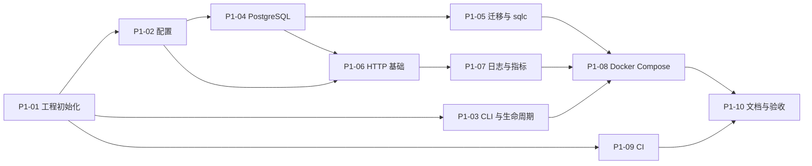

# OneIssuer 第一阶段开发计划：工程基础

> 状态：Implemented and verified（2026-08-01）  
> 对应总体方案：[`go-backend-design.md`](./go-backend-design.md) 的“阶段一：项目基础”  
> 建议版本标识：`v0.1.0-dev.1`  
> 适用范围：单 Issuer、非多租户、自托管部署  
> 预计工作量：单人约 7–10 个有效开发日，不包含真实 OIDC 业务功能

## 1. 阶段定位

第一阶段只建设后续身份与 OIDC 功能必须依赖的工程底座，不以“用户已经能够登录”为完成
标准。阶段结束时，仓库应从纯前端原型演进为一个可重复构建、可连接 PostgreSQL、可观测、
可迁移、可容器化运行的模块化单体项目。

本阶段的核心演示是：

```text
全新克隆仓库
→ 准备环境变量
→ docker compose -f deploy/docker-compose.yml up --build
→ 数据库迁移成功
→ OneIssuer 启动并通过就绪检查
→ 日志、指标和请求 ID 可观测
→ 停止数据库后 ready 失败但 live 仍成功
→ CI 对 Go 与现有 Web 原型同时执行质量检查
```

## 2. 阶段目标

### 2.1 必须完成

1. 初始化 Go Module、模块化单体目录和统一开发命令；
2. 实现强类型配置加载、默认值、脱敏输出和启动前校验；
3. 实现应用启动、依赖组装、信号处理和优雅关闭；
4. 接入 PostgreSQL、`pgx/v5`、`goose` 和 `sqlc`；
5. 提供 `/health/live`、`/health/ready` 和 `/metrics`；
6. 提供请求 ID、JSON 结构化日志、统一错误和 Panic 恢复；
7. 提供非 Root 多阶段 Docker 镜像和本地 Docker Compose；
8. 建立 Go、Web、容器构建和依赖安全检查的 CI；
9. 写清本地开发、配置、迁移、测试和故障排查方式；
10. 保持现有中文/英文 Web 原型可以独立启动和构建。

### 2.2 本阶段明确不做

- 不创建真实用户、密码凭证或登录 Session；
- 不实现 `/oauth2/authorize`、`/oauth2/token`、Discovery 或 JWKS；
- 不把前端 Mock Data 替换为真实 API；
- 不实现管理员登录、RBAC 或管理 API；
- 不实现签名、Token、Consent、注册、邮件或 Passkey；
- 不创建 `tenant_id`、Organization、Realm 等多租户结构；
- 不发布生产可用声明，也不申请 OIDC Conformance 认证。

上述能力分别从第二、第三和第四阶段开始实现。第一阶段可以预留清晰的模块目录与配置边界，
但禁止用空表、空接口或“以后可能需要”为理由提前堆积抽象。

## 3. 阶段交付物

| 类别 | 交付物 | 验收结果 |
| --- | --- | --- |
| Go 入口 | `cmd/oneissuer/main.go` | 二进制支持 `serve`、`migrate`、`config check`、`version` |
| 配置 | `internal/config`、`.env.example` | 缺失或危险配置会在启动前失败 |
| 生命周期 | `internal/app` | 支持依赖组装、SIGINT/SIGTERM 和有界优雅关闭 |
| HTTP | `internal/httpserver` | 健康检查、指标、中间件和统一错误可用 |
| 数据库 | `internal/storage/postgres` | 连接池、探活、关闭和错误分类可用 |
| 迁移 | `migrations/`、Goose 命令 | 从空库可重复执行并查询迁移状态 |
| SQL | `queries/`、`sqlc.yaml` | `sqlc generate` 可重复且无未提交生成差异 |
| 可观测性 | `slog`、Prometheus | 日志包含请求上下文，指标无高基数标签 |
| 部署 | `Dockerfile`、`deploy/docker-compose.yml` | 一条命令可启动 PostgreSQL 与 OneIssuer |
| 工具 | `Makefile` | 常用开发、检查、迁移和容器命令统一 |
| CI | `.github/workflows/ci.yml` | Go、Web、漏洞和镜像检查全部通过 |
| 文档 | README、开发与故障排查说明 | 新贡献者不阅读源码也能启动项目 |

## 4. 完成后的目录结构

```text
OneIssuer/
├── .github/
│   ├── ISSUE_TEMPLATE/
│   └── workflows/
│       └── ci.yml
├── cmd/
│   └── oneissuer/
│       └── main.go
├── internal/
│   ├── app/                    # 依赖组装、启动和关闭
│   ├── config/                 # 环境变量、默认值和校验
│   ├── httpserver/             # Router、Middleware、健康检查
│   ├── observability/          # slog 与 Prometheus 初始化
│   └── storage/
│       └── postgres/           # pgxpool、探活和事务基础设施
├── migrations/                # Goose 迁移；不提前创建无用业务表
├── queries/                    # sqlc SQL；第一阶段只保留必要系统查询
├── api/
│   └── openapi.yaml            # 只描述已实现的健康检查 API
├── deploy/
│   └── docker-compose.yml
├── docs/
├── web/                        # 已完成的 React UI 原型
├── .dockerignore
├── .env.example
├── .golangci.yml               # golangci-lint 规则
├── CODE_OF_CONDUCT.md
├── CONTRIBUTING.md
├── LICENSE                      # 由仓库所有者确认许可证后加入
├── SECURITY.md
├── go.mod
├── go.sum
├── sqlc.yaml
├── Dockerfile
├── Makefile
└── README.md
```

暂时不创建只有占位文件的 `identity`、`oidc`、`token` 等包。第二阶段开始实现相应用例时再
加入，避免出现没有真实边界的接口和循环依赖。

## 5. 关键工程决策

### 5.1 一个进程和一个数据库

第一阶段坚持模块化单体：一个 Go 进程、一个 PostgreSQL 数据库、一个 Issuer。健康检查、
指标和后续 OIDC 端点共享同一个应用生命周期，不拆分微服务。

### 5.2 迁移使用显式命令

生产服务不在每次 `serve` 时静默修改数据库。二进制提供：

```bash
oneissuer migrate up
oneissuer migrate status
oneissuer migrate version
```

Docker Compose 使用一次性 `migrate` 服务，在迁移成功后启动应用。后续部署文档也应允许
平台在发布前单独执行迁移。`serve` 只读取并核对迁移版本，不自动改表；检测到待执行迁移时
应快速失败，并提示先运行 `oneissuer migrate up`。迁移失败必须阻止新版本进入 Ready 状态。

### 5.3 配置只来自可信来源

第一阶段使用环境变量，不根据请求的 `Host`、`X-Forwarded-Host` 等值推导 Issuer。
反向代理头默认不信任，只有配置的代理网段才可生效。

### 5.4 前后端暂时解耦运行

- Go 服务默认监听 `http://localhost:8080`；
- Vite 原型继续监听 `http://localhost:5173`；
- 第一阶段不把 React 构建产物嵌入 Go 二进制；
- 第一阶段不引入没有真实调用方的 CORS 放行规则；
- 后续接入 API 时优先使用 Vite Dev Proxy，生产环境保持同源部署。

### 5.5 不创建无业务语义的数据结构

Goose 和 sqlc 的工具链在本阶段必须可运行，但用户、Client、Session 和 Token 表留到对应
用例进入开发时创建。数据库中不加入占位 `tenant_id`，也不为了展示迁移而创建无用途的
业务表。Goose 自身的版本元数据表属于迁移基础设施；Down/Up 测试使用不会进入生产镜像的
测试迁移。sqlc 使用供 Ready 检查调用的 `SELECT 1` 系统查询验证生成链路，不生成空置的
业务 Repository。

## 6. 命令行契约

第一阶段推荐使用标准库 `flag` 完成小型子命令，不为少量命令引入大型 CLI 框架。

```text
oneissuer serve
oneissuer migrate up
oneissuer migrate status
oneissuer migrate version
oneissuer config check
oneissuer version
```

行为要求：

- 未提供子命令时输出帮助并以非零状态退出；
- `config check` 只校验，不打印数据库密码等秘密；
- `version` 输出版本、Commit SHA、构建时间和 Go 版本；
- 所有命令遵守上下文取消和明确的退出码；
- CLI 错误写入 stderr，正常机器可读结果写入 stdout；
- 不在命令行参数中接收密码或 Token，避免进入 Shell History。

## 7. 配置契约

### 7.1 第一阶段环境变量

| 变量 | 必填范围 | 开发默认值 | 校验规则 |
| --- | --- | --- | --- |
| `ONEISSUER_ENV` | 否 | `development` | 仅允许 `development`、`test`、`production` |
| `ONEISSUER_ISSUER` | 生产必填 | `http://localhost:8080` | 绝对 URL；生产环境必须 HTTPS；不能含 Query/Fragment |
| `ONEISSUER_HTTP_ADDR` | 否 | `:8080` | 合法监听地址 |
| `ONEISSUER_DATABASE_URL` | 是 | 无 | PostgreSQL URL；日志中必须脱敏 |
| `ONEISSUER_LOG_LEVEL` | 否 | `info` | `debug`、`info`、`warn`、`error` |
| `ONEISSUER_LOG_FORMAT` | 否 | `json` | `json` 或开发用 `text` |
| `ONEISSUER_SHUTDOWN_TIMEOUT` | 否 | `15s` | 必须为正且设置安全上限 |
| `ONEISSUER_HTTP_READ_HEADER_TIMEOUT` | 否 | `5s` | 必须为正 |
| `ONEISSUER_HTTP_READ_TIMEOUT` | 否 | `10s` | 必须为正 |
| `ONEISSUER_HTTP_WRITE_TIMEOUT` | 否 | `30s` | 必须为正 |
| `ONEISSUER_HTTP_IDLE_TIMEOUT` | 否 | `60s` | 必须为正 |
| `ONEISSUER_HTTP_MAX_HEADER_BYTES` | 否 | `1048576` | 正整数，且不超过安全上限 |
| `ONEISSUER_DATABASE_MAX_CONNS` | 否 | `10` | 正整数，且不超过安全上限 |
| `ONEISSUER_TRUSTED_PROXIES` | 否 | 空 | 逗号分隔 CIDR；空表示不信任代理头 |

签名密钥、Cookie、Token 有效期和注册策略等配置在相应模块进入开发后加入，不在第一阶段
制造“已支持”的错觉。

### 7.2 配置优先级

```text
代码安全默认值 < 环境变量 < 测试中显式注入
```

生产运行不自动读取当前目录的 `.env`。`.env.example` 仅用于本地开发，由 Compose 或开发者
显式加载。配置错误应一次性列出所有可发现问题，方便部署者修复。

配置校验按命令裁剪，避免无关依赖阻塞工具命令：

- `version` 和帮助命令不读取运行配置；
- `migrate *` 只要求数据库相关配置；
- `serve` 与 `config check` 校验完整的服务配置；
- `production` 环境必须显式提供 `ONEISSUER_ISSUER`，不能沿用开发默认值。

## 8. HTTP 基础契约

### 8.1 第一阶段端点

| 方法 | 路径 | 成功响应 | 用途 |
| --- | --- | --- | --- |
| `GET` | `/health/live` | `200` | 只检查进程仍可响应 HTTP，不访问外部依赖 |
| `GET` | `/health/ready` | `200` 或 `503` | 检查数据库和必要初始化状态 |
| `GET` | `/metrics` | Prometheus Text | 导出应用和数据库指标 |

第一阶段不返回伪造的 Discovery 或 OIDC 响应。尚未实现的业务路径应为 `404`，而不是带有
错误语义的 `200`。

### 8.2 健康检查响应

`/health/live`：

```json
{
  "status": "ok"
}
```

`/health/ready` 成功：

```json
{
  "status": "ready"
}
```

`/health/ready` 失败：

```json
{
  "status": "unavailable",
  "request_id": "req_..."
}
```

就绪失败响应不能泄露数据库主机、用户名、连接串或内部错误栈。具体原因只写入经过脱敏的
服务端日志。数据库探活应有独立的短超时，不能占满整个 HTTP 请求超时。

健康检查响应使用 `application/json; charset=utf-8`。除健康检查外，框架层的 `404`、`405`
和 `500` 统一返回以下最小结构，`code` 使用稳定的机器可读值，`message` 不暴露内部细节：

```json
{
  "error": {
    "code": "not_found",
    "message": "resource not found",
    "request_id": "req_..."
  }
}
```

### 8.3 中间件顺序

```text
Request ID
→ Trusted Proxy 解析（默认关闭）
→ 访问日志和指标
→ Panic Recovery
→ 安全响应头
→ Router
```

要求：

- 接受外部 `X-Request-ID` 时必须限制格式和长度，否则生成新的随机 ID；
- 响应始终返回 `X-Request-ID`；
- 日志记录路由模板而不是原始高基数 URL；
- 未匹配路由使用固定的 `unmatched` 标签，绝不回退到原始 URL；
- Panic 返回通用 `500`，错误栈只写服务器日志；
- 设置 `X-Content-Type-Options: nosniff`、合理的 `Referrer-Policy` 等基础响应头；
- HTTP Server 配置 Read Header、Read、Write、Idle 和最大 Header 大小限制。

## 9. PostgreSQL、迁移与 sqlc

### 9.1 连接池

- 使用 `pgxpool`，连接创建和数据库探活均接受 Context；
- 启动时验证连接，失败则快速退出；
- 最大连接数来自强类型配置；
- 应用关闭时停止接收请求，再关闭连接池；
- 错误日志只包含分类和 Request ID，不包含完整 SQL 参数或连接串；
- 业务代码后续通过存储实现访问数据库，不直接依赖全局连接池。

### 9.2 迁移规则

- 文件名格式：`00001_description.sql`；
- 每个迁移同时包含 `Up` 与 `Down`，不可逆迁移必须显式说明；
- 已合并或已发布的迁移不得修改，只能新增；
- DDL 尽量在事务中执行；
- 大表回填和长锁迁移在后续阶段单独设计；
- CI 从空 PostgreSQL 执行全部 Up，再至少验证一次 Down/Up；
- Compose 迁移任务只运行一次，不和多个应用副本竞争执行。

生产迁移目录在没有业务迁移时只保留说明文件；集成测试迁移放在
`internal/storage/postgres/testdata/migrations/`，不得被生产迁移命令扫描或复制到运行镜像。

### 9.3 sqlc 规则

- SQL 文件是查询语义的唯一来源；
- 生成代码不手工编辑；
- `make generate` 后工作区必须无差异；
- 查询命名使用用例语义，不使用 `Query1` 等无意义名称；
- 第一阶段用 Ready 检查实际调用的 `SELECT 1` 系统查询验证生成链路，不提前创建业务
  Repository。

## 10. 日志、指标与隐私

### 10.1 结构化日志

生产默认 JSON，每条 HTTP 日志至少包含：

```text
timestamp, level, message, request_id, method, route, status, duration_ms
```

进程级日志增加：

```text
version, commit, environment
```

以下内容禁止记录：

- `ONEISSUER_DATABASE_URL` 的密码部分；
- Authorization、Cookie 和未来的 Token、Code、Client Secret；
- 完整请求体；
- Panic 中可能含秘密的原始对象；
- 未经隐私评审的邮箱、IP 和 User-Agent 全量值。

### 10.2 Prometheus 指标

第一阶段至少提供：

```text
oneissuer_build_info
oneissuer_http_requests_total{method,route,status_class}
oneissuer_http_request_duration_seconds{method,route}
oneissuer_http_in_flight_requests
oneissuer_database_pool_connections{state}
oneissuer_readiness_status
```

`request_id`、原始 URL、IP、邮箱等高基数字段不得成为 Metric Label。生产部署应在反向代理或
网络策略中限制 `/metrics`，第一阶段文档必须明确它不是面向公网用户的业务接口。

## 11. 应用生命周期

`serve` 启动顺序：

```text
解析子命令
→ 加载并校验配置
→ 初始化日志和构建信息
→ 建立 PostgreSQL 连接池
→ 只读核对数据库迁移版本
→ 初始化指标和 HTTP Router
→ 开始监听
→ 标记 Ready
```

关闭顺序：

```text
收到 SIGINT/SIGTERM
→ 立刻标记 Not Ready
→ 停止接受新连接
→ 在 Shutdown Timeout 内等待请求结束
→ 关闭数据库连接池
→ 刷新必要日志
→ 以 0 退出
```

如果超过关闭超时，应记录明确错误并以非零状态退出，不能无限等待。

## 12. Docker 与本地开发

### 12.1 Dockerfile

- 多阶段构建；
- Builder 固定 Go 工具链版本；
- Runtime 使用精简基础镜像并以非 Root 用户运行；
- 只复制二进制、CA 证书和必要资源；
- 镜像中不包含 `.git`、Node Modules、源码秘密或私钥；
- 设置 OCI Label：版本、Commit、源码仓库和 License；
- Dockerfile 不写死 CPU 架构，CI 至少验证 `linux/amd64`；多架构镜像发布留到阶段五；
- 容器退出信号和优雅关闭行为经过测试。

### 12.2 Docker Compose

建议服务：

```text
postgres   PostgreSQL + volume + healthcheck
migrate    一次性数据库迁移任务
oneissuer  Go 服务，等待 postgres 和 migrate 成功
```

开发默认端口：

```text
OneIssuer API  http://localhost:8080
Web prototype  http://localhost:5173
PostgreSQL     仅本机开发需要时映射
```

Compose 仅提供开发安全默认值，生产部署不能直接复用示例密码。

### 12.3 Makefile 命令

```text
make tools          安装或验证固定版本开发工具
make generate       执行 sqlc 和其他代码生成
make fmt            格式化 Go 代码
make fmt-check      检查格式但不修改文件
make lint           静态检查 Go 与 Web
make test           单元与集成测试
make check          fmt-check + lint + test + build
make migrate-up     执行本地迁移
make migrate-status 查看迁移状态
make dev            启动 Go 开发服务
make web            启动 Vite 原型
make compose-up     启动完整本地依赖
make compose-down   停止本地依赖
```

命令应在 Linux 和 macOS 可用；Windows 开发者优先通过 WSL2 使用同一流程。Go、sqlc、Goose、
golangci-lint 和 govulncheck 均固定版本，禁止在 CI 中临时安装不固定版本的 `latest`。

## 13. 工作项拆分

| ID | 工作项 | 主要产出 | 前置 | 建议工作量 |
| --- | --- | --- | --- | --- |
| `P1-01` | Go 工程初始化 | `go.mod`、入口、目录、构建信息 | 无 | 0.5–1 天 |
| `P1-02` | 配置系统 | 强类型配置、校验、脱敏、测试 | `P1-01` | 1 天 |
| `P1-03` | 生命周期与 CLI | 子命令、信号、优雅关闭 | `P1-01` | 1 天 |
| `P1-04` | PostgreSQL 基础 | pgxpool、探活、错误和集成测试 | `P1-02` | 1 天 |
| `P1-05` | Goose 与 sqlc | 迁移命令、配置、生成检查 | `P1-04` | 1 天 |
| `P1-06` | HTTP 基础 | Router、中间件、健康检查 | `P1-02`、`P1-04` | 1–1.5 天 |
| `P1-07` | 日志与指标 | slog、Prometheus、隐私过滤 | `P1-06` | 1 天 |
| `P1-08` | 容器与 Compose | Dockerfile、迁移服务、本地环境 | `P1-03`–`P1-07` | 1 天 |
| `P1-09` | CI 质量门 | Go/Web/镜像/漏洞检查 | 可并行 | 1 天 |
| `P1-10` | 开源与开发文档 | README、贡献、安全和故障排查 | 全部 | 0.5–1 天 |

### 13.1 依赖关系



## 14. 建议 PR 顺序

为了让开源仓库的提交历史容易审阅，建议按可独立验证的 PR 合并：

1. `chore/backend-bootstrap`：Go Module、目录、Makefile、版本信息；
2. `feat/runtime-config`：配置、CLI、应用生命周期；
3. `feat/postgres-foundation`：pgxpool、迁移和 sqlc；
4. `feat/http-health-observability`：HTTP、健康检查、日志和指标；
5. `build/container-compose`：Dockerfile、Compose 和启动演示；
6. `ci/quality-gates`：Go、Web、镜像与安全检查；
7. `docs/developer-onboarding`：README、贡献指南和故障排查。

每个 PR 都应包含对应测试和文档，禁止把整个阶段压成一个无法审阅的大提交。

## 15. 测试计划

### 15.1 单元测试

- 配置默认值、合法值和所有非法组合；
- 生产环境 HTTP Issuer 被拒绝；
- 数据库 URL 和配置日志脱敏；
- Request ID 生成、透传、非法输入替换；
- Health Handler 的 Ready/Not Ready 分支；
- Panic Recovery 不泄露错误栈；
- Context 取消和关闭超时。

### 15.2 PostgreSQL 集成测试

- Testcontainers 启动真实 PostgreSQL；
- 空环境连接、Ping 和关闭；
- 迁移 Up、Status、Down/Up；
- 错误凭据、数据库不可用和连接恢复；
- 重复执行 `migrate up` 不产生额外变更，测试迁移可完整 Down/Up；
- 测试结束后无连接或容器泄漏。

### 15.3 HTTP 集成测试

- `/health/live` 不依赖数据库；
- `/health/ready` 在数据库正常时为 `200`；
- 数据库不可用时 Ready 为 `503`，Live 仍为 `200`；
- 所有响应包含合法 `X-Request-ID`；
- `/metrics` 可被 Prometheus Parser 解析；
- 未知路由和不支持的方法分别返回契约规定的 `404`、`405`；
- SIGTERM 期间先变为 Not Ready，再完成已有请求。

### 15.4 容器烟雾测试

```bash
docker compose -f deploy/docker-compose.yml up --build -d
curl --fail http://localhost:8080/health/live
curl --fail http://localhost:8080/health/ready
curl --fail http://localhost:8080/metrics
docker compose -f deploy/docker-compose.yml stop postgres
curl --fail http://localhost:8080/health/live
test "$(curl -s -o /dev/null -w '%{http_code}' http://localhost:8080/health/ready)" = "503"
docker compose -f deploy/docker-compose.yml down -v
```

## 16. CI 质量门

### 16.1 Go Job

```text
make fmt-check
go vet ./...
go test -race ./...
golangci-lint run ./...
govulncheck ./...
sqlc generate 后无差异
空 PostgreSQL 执行迁移
```

### 16.2 Web Job

```text
npm ci
npm run check
npm audit --audit-level=high
```

### 16.3 Container Job

```text
docker build
以非 Root 用户运行验证
Compose 健康检查烟雾测试
Trivy 对镜像执行 High/Critical 漏洞扫描
```

CI 中的第三方 Action 固定到完整 Commit SHA，并通过 Dependabot 或 Renovate 更新；工作流使用
最小权限，默认只授予 `contents: read`。来自 Fork 的 PR 不获得发布 Secret。

## 17. 开源仓库基础

第一阶段应补齐：

- 根目录 `README.md`：定位、状态、快速开始和生产限制；
- `CONTRIBUTING.md`：开发环境、分支、提交、测试和 PR 规则；
- `SECURITY.md`：私下报告漏洞的渠道，禁止公开提交未修复漏洞细节；
- `CODE_OF_CONDUCT.md`：社区行为规范；
- Issue 与 Pull Request Template；
- License 决策。

License 建议优先评估 Apache-2.0，因为它提供明确的专利授权；如维护者更强调极简采用成本，
可选择 MIT。正式公开发布前必须由仓库所有者确认，开发计划不代替法律意见。

## 18. 阶段验收脚本

验收人员应能在没有本地 Go 和 PostgreSQL 的机器上，仅依赖 Docker 完成：

```bash
git clone <repository>
cd OneIssuer
cp .env.example .env
docker compose -f deploy/docker-compose.yml up --build -d
curl -i http://localhost:8080/health/live
curl -i http://localhost:8080/health/ready
curl -i http://localhost:8080/metrics
```

预期：

1. PostgreSQL 健康；
2. 迁移任务以 `0` 退出；
3. OneIssuer 以非 Root 用户运行；
4. Live 与 Ready 返回 `200`；
5. 日志为结构化格式且不包含数据库密码；
6. 每个 HTTP 响应包含 `X-Request-ID`；
7. 停止 PostgreSQL 后 Ready 在有限时间内变为 `503`，Live 保持 `200`；
8. 恢复 PostgreSQL 后 Ready 自动回到 `200`；
9. SIGTERM 在配置的关闭超时内正常退出；
10. 现有 `web/` 原型仍可执行 `npm run check`。

## 19. Definition of Done

以下项目全部满足后，第一阶段才算完成：

- [x] `make check` 在全新环境通过；
- [x] `docker compose -f deploy/docker-compose.yml up --build` 可从空卷启动；
- [x] Live、Ready、Metrics 契约及故障场景通过自动化测试；
- [x] 配置错误在监听端口前被发现并给出可行动提示；
- [x] 数据库密码、环境秘密和未来的认证敏感字段不会进入日志；
- [x] 进程能处理 SIGINT/SIGTERM 并优雅关闭；
- [x] 迁移从空库执行，并有 Down/Up 验证；
- [x] Go Race、Vet、静态检查、govulncheck 通过；
- [x] Web Lint、TypeScript、Build 和高危依赖审计通过；
- [x] 容器以非 Root 用户运行且镜像扫描无未接受的高危漏洞；
- [x] README、CONTRIBUTING 和 SECURITY 文档可供新贡献者使用；
- [x] 已按本计划首选方案采用 Apache-2.0，并加入 `LICENSE`；
- [x] 未加入多租户占位字段或未使用的业务抽象；
- [x] 阶段演示结果记录到 Pull Request 或 Release Notes。

## 20. 风险与控制

| 风险 | 影响 | 控制措施 |
| --- | --- | --- |
| 工程底座过度设计 | 延迟 OIDC 主流程 | 只为真实外部边界定义接口，禁止占位模块 |
| 自动迁移导致生产风险 | 多副本竞争或锁表 | 显式 migrate 命令，部署前单独执行 |
| 配置泄露 | 数据库凭据进入日志 | 配置类型实现 Redacted String，测试日志输出 |
| Ready 探活过重 | 数据库故障时放大压力 | 短超时、简单 Ping、合理探活周期 |
| Metric 高基数 | Prometheus 内存增长 | 仅使用路由模板和状态类别作为 Label |
| Compose 被误当生产方案 | 使用弱密码上线 | README 醒目标注，生产部署文档后续补充 |
| 前后端同时变化导致范围膨胀 | 第一阶段无法收口 | Web 只进入 CI，不接真实 API |
| 工具版本漂移 | 生成结果和 CI 不一致 | 固定工具版本，`make tools` 可验证 |

## 21. 进入第二阶段的交接条件

第二阶段的详细范围、依赖关系与验收标准见
[`phase-2-development-plan.md`](./phase-2-development-plan.md)。

第一阶段通过验收后，第二阶段才开始创建业务数据表和真实用例，顺序建议为：

1. `users` 与 `credentials`；
2. Argon2id 密码哈希与登录 Session；
3. `oidc_clients`、Redirect URI、Scope 和 Secret；
4. 管理员 Bootstrap 命令；
5. 用户、Client 和审计管理 API；
6. 认证页面逐步从 Mock Data 切换到真实事务。

交接时应冻结第一阶段的配置、健康检查和迁移调用方式，后续模块通过这些稳定边界接入，
而不是绕过应用生命周期创建全局数据库连接或独立日志系统。
