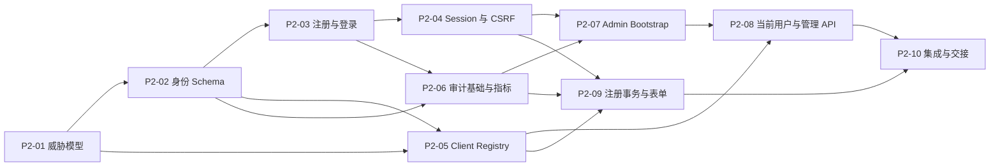

# OneIssuer 第二阶段开发计划：身份与 Client 基础

> 状态：Implemented and verified；2026-08-01 Definition of Done 全项通过  
> 对应总体方案：[`go-backend-design.md`](./go-backend-design.md) 的“阶段二：身份与 Client”  
> 前置阶段：[`phase-1-development-plan.md`](./phase-1-development-plan.md)（已完成并验收）  
> 建议版本标识：`v0.1.0-dev.2`  
> 适用范围：单 Issuer、非多租户、自托管部署  
> 预计工作量：单人约 13–18 个有效开发日，不包含完整 OIDC 协议端点

## 1. 阶段定位

第一阶段已经建立了可重复构建、可连接 PostgreSQL、可迁移、可观测和可优雅关闭的
工程底座。第二阶段在这些稳定边界之上引入第一批真正的身份业务数据和用例：用户、
密码凭证、浏览器登录会话、OIDC Client、管理员基础管理能力以及安全审计。

本阶段的目标不是让 OneIssuer 立即成为完整的 OIDC Provider，而是把“谁可以登录、
哪个应用可以接入、登录状态如何保存、管理员如何管理这些对象”做成可测试且安全的
业务基础。第三阶段再把这些用例接到 Discovery、Authorize、Token 和 UserInfo 协议
端点上。

本阶段必须继续遵守：

- 一个进程、一个 PostgreSQL 数据库、一个 Issuer；
- 不创建 `tenant_id`、Organization、Realm 或隐藏的多租户开关；
- 第一阶段的配置加载、生命周期、健康检查、日志和迁移调用方式保持兼容；
- 业务模块通过明确的用例边界访问存储，不创建全局数据库连接或第二套日志系统；
- 不把 React Mock Data 直接当作可信身份状态，也不让浏览器脚本代收集密码再转发。

## 2. 阶段演示

完成后，开发者应能在空数据库上完成以下演示：

```text
docker compose 启动 PostgreSQL
→ oneissuer migrate up
→ oneissuer admin bootstrap（终端隐藏输入密码）
→ 管理员登录并创建一个 Public Client 和一个 Confidential Client
→ 配置精确 Redirect URI、退出回调地址和允许 Scope
→ 通过 OneIssuer 自托管注册页创建普通用户
→ 使用用户名或规范化邮箱登录，获得 HttpOnly 会话 Cookie
→ 当前用户查看并撤销自己的会话
→ 管理员禁用用户、轮换 Client Secret、查询审计事件
→ 重启进程后数据、禁用状态和会话撤销状态仍然正确
```

第二阶段可以提供受服务器保护的登录/注册表单和内部授权事务存储，但**不**提供
伪造的 OAuth/OIDC 成功响应。对外协议流程从第三阶段开始；第二阶段的注册恢复测试
使用已验证的内部授权事务对象，不接受任意 `return_to` 或未经验证的 Redirect URI。

## 3. 目标与非目标

### 3.1 必须完成

1. `users` 与 `credentials` 数据模型、迁移、sqlc 查询和领域用例；
2. Argon2id 密码摘要、参数安全边界、登录校验和旧参数重新哈希；
3. 登录 Session 的高熵 Cookie、数据库摘要、轮换、过期、登出和撤销；
4. 登录/注册表单需要的 CSRF 保护、固定会话防护和安全错误语义；
5. 自助注册、重复注册竞态处理、禁用用户和注册后会话创建；
6. Public/Confidential OIDC Client、精确 Redirect URI、退出回调和 Scope 配置；
7. Client Secret 生成、只保存摘要、只展示一次和安全轮换；
8. 首个管理员 Bootstrap 命令、管理员会话鉴权和最小管理 API；
9. 短期、服务器持有的授权/注册事务，用于后续 `prompt=create` 恢复；
10. 不含凭证的追加式审计事件和低基数身份/管理指标；
11. Testcontainers PostgreSQL、并发、隐私、安全负向测试和操作文档；
12. 更新 OpenAPI、配置参考、迁移说明、排障说明和第二阶段 Release Notes 模板。

### 3.2 明确不做

以下能力不进入本阶段的完成标准：

- `/.well-known/openid-configuration`、`/oauth2/jwks`、`/oauth2/authorize`；
- `/oauth2/token`、ID Token、Access Token、UserInfo、Revoke、Introspection；
- Authorization Code 的协议签发与消费、完整 PKCE 协议校验；
- Refresh Token rotation/reuse detection；
- OIDC 签名密钥、JWK/JWKS、密钥轮换和 `oneissuer keys` 命令；
- 邮箱验证、密码找回、邮件发送、MFA、Passkey 或上游身份源；
- 通用 RBAC、权限编辑器、Organization、Realm 和多租户隔离；
- 将整个 React 管理控制台切换为真实 API；
- 生产级分布式限流、风控、CAPTCHA 和 OpenID Foundation Conformance；
- 生产发布声明或对外兼容性承诺。

本阶段虽然不实现完整 PKCE 和 Token，但会保存后续授权事务所需的最小、已验证上下文，
并为第三阶段的协议适配提供明确接口；不会提前创建 `authorization_codes`、
`access_tokens` 或 `refresh_tokens` 表。

## 4. 交接前提与冻结边界

开工前先确认以下第一阶段边界不改变：

| 边界 | 第二阶段约束 |
| --- | --- |
| 配置 | 继续使用环境变量；扩展配置必须经过聚合校验和安全默认值检查 |
| 数据库 | 仍由显式 `migrate up` 修改；`serve` 只读检查版本 |
| 生命周期 | 业务模块由 `internal/app` 组装，关闭时先摘除 Ready，再关闭 HTTP 和连接池 |
| HTTP | 沿用 Request ID、统一错误、访问日志、安全响应头和可信代理策略 |
| 日志 | 任何密码、Cookie、Secret、授权事务值和认证表单字段都不可写入日志 |
| 指标 | 只使用固定枚举标签，不使用用户 ID、Client ID、邮箱或原始 URL |
| 部署 | Compose 仍使用一次性迁移服务；示例密码只允许本地开发使用 |
| Web | `web/` 继续可以独立启动；真实密码表单由 OneIssuer Origin 托管 |

### 4.1 开工默认决策

除非 P2-01 的威胁模型发现明确问题，实施按以下默认决策推进：

| 主题 | 默认决策 |
| --- | --- |
| Hosted UI | 第二阶段先使用 Go 服务器模板承载最小登录/注册表单，React 原型继续独立运行 |
| 身份标识 | 内部 UUID 与外部随机 `subject` 分离；邮箱和用户名都不能充当 `sub` |
| 登录标识 | 支持用户名或规范化邮箱，错误语义不暴露命中的是哪一种 |
| 管理员 | 管理员仍是 User，仅使用最小 `admin` role，不创建独立默认管理员表或通用 RBAC |
| 删除语义 | 第二阶段只支持禁用，不物理删除 User/Client 或破坏审计外键 |
| API 鉴权 | 当前用户和管理员 API 使用同源 Session Cookie + CSRF，不新增长期管理 Bearer Token |
| Client Secret | 服务端生成、摘要存储、只展示一次；Public Client 永不拥有 Secret |
| 协议边界 | 不挂载未完成的 OIDC 路由，第三阶段才将协议解析结果传给 `authflow` |

## 5. 推荐目录与模块边界

第二阶段新增目录应只对应已经进入范围的真实用例：

```text
internal/
├── identity/                 # User、Credential、注册和登录用例
├── client/                   # OIDC Client、URI、Scope 和 Secret 用例
├── session/                  # Cookie、Session、CSRF 和撤销
├── authflow/                 # 已验证的短期注册/授权事务上下文
├── admin/                    # 管理员鉴权、管理 API 和输入映射
├── audit/                    # 追加式事件模型、脱敏和写入用例
├── httpserver/
│   ├── auth_handlers.go       # 服务器托管的登录/注册/登出表单
│   └── admin_handlers.go     # /api/admin/v1 路由
└── storage/postgres/
    ├── identity/              # sqlc 查询适配
    ├── client/                # sqlc 查询适配
    ├── session/               # sqlc 查询适配
    └── audit/                 # sqlc 查询适配
```

模块职责：

- `identity` 只负责身份和凭证规则，不负责 HTTP Cookie 或管理员权限；
- `client` 只负责 Client 注册资料、回调地址、Scope 和 Secret 生命周期；
- `session` 只负责浏览器会话、CSRF 和撤销，不把 Token 放进 Cookie；
- `authflow` 只保存短期、服务器生成的事务上下文，不解析原始 OIDC 请求；
- `admin` 负责把已认证管理员映射到用例，不在 Handler 中拼 SQL；
- `audit` 提供结构化事件和值过滤，调用方不能写入任意敏感字段；
- `storage/postgres` 是具体实现，领域用例不直接依赖全局 `pgxpool.Pool`。

只在时钟、随机数、密码哈希器、事务存储和外部密钥等真实边界定义接口。不要为每个
实体或 DTO 自动创建无行为的接口。

## 6. 领域模型与不变量

### 6.1 User 与 Credential

用户表至少包含以下语义字段：

| 字段 | 规则 |
| --- | --- |
| `id` | 应用生成的 UUID，内部使用，不作为可猜测的公开编号 |
| `subject` | 独立生成的稳定、不透明 `sub` 值；不能由邮箱或用户名推导 |
| `username` / `username_normalized` | 展示值与规范化值分离；规范化值唯一 |
| `display_name` | 用户可见名称，不唯一；输出到 HTML 前必须进行上下文转义 |
| `email` / `email_normalized` | 注册和 Bootstrap 默认必填；规范化值唯一，不能直接作为 `sub` |
| `email_verified` | 初始为 `false`；本阶段不实现邮箱验证流程 |
| `status` | 至少支持 `active`、`disabled`；禁用用户不能登录 |
| `role` | 只提供最小 `user` / `admin` 两类，不扩展通用 RBAC |
| `created_at`、`updated_at`、`last_login_at` | `timestamptz`，Go 中统一按 UTC 处理 |

凭证表至少包含：

- `user_id`、凭证类型 `password`、PHC 格式 Argon2id 摘要、创建/更新时间；
- 一个用户最多一个当前密码凭证，未来凭证类型通过真实用例扩展；
- 禁止保存明文密码、可逆加密密码或客户端提交的密码副本；
- sqlc 生成查询不得返回密码摘要到日志、JSON 或审计元数据。

密码策略默认面向无 MFA 的单因素认证：建议最少 15 个字符、允许至少 64 个字符并设置
合理的字节上限，不强制大小写/数字/符号组合，允许粘贴和密码管理器。密码按用户输入的
原始字节验证，不做 Unicode 规范化、自动 trim 或大小写转换；只拒绝协议无法安全处理的
输入和超过资源上限的值。具体长度及常见弱密码策略在 P2-01 ADR 中冻结。

必须保证：

1. 用户名和规范化邮箱的唯一性由数据库约束最终保证，不能只靠先查后插；
2. 并发重复注册只能有一个成功，另一个得到稳定的非敏感业务错误；
3. 禁用、已删除或不存在的用户使用等价的登录失败语义，避免账号枚举；
4. 登录成功后更新 `last_login_at` 不得覆盖会话创建事务的核心结果；
5. 禁用用户或变更其管理员角色时，在同一事务中撤销现有会话；请求鉴权仍检查当前用户状态；
6. 任何身份查询默认只返回业务所需字段，不返回完整凭证记录。

规范化规则必须在 ADR 中固定：推荐对输入做 Unicode NFC 和首尾空白处理，对用户名使用
明确的大小写策略，对邮箱只做协议安全且可解释的规范化（例如域名小写），禁止模拟特定
邮箱服务商删除点号或 `+tag`。不存在用户的登录路径仍执行固定的 dummy Argon2id 校验，
避免明显的时间差泄露账号是否存在。

### 6.2 OIDC Client

`oidc_clients` 表表达注册资料和协议配置，但不执行第三阶段的协议流程：

| 领域 | 规则 |
| --- | --- |
| 类型 | `public` 或 `confidential` |
| 客户端认证 | Public 只能为 `none`；Confidential 首版为 `client_secret_basic` |
| Client ID | 服务端生成的高熵、稳定、唯一字符串 |
| 展示信息 | 名称、可选描述和受限 Logo 元数据；不接受请求中的任意 HTML |
| 状态 | 至少支持 `active`、`disabled` |
| 注册开关 | Client 是否允许发起自助注册；还受全局配置控制 |
| Scope | 只能从服务端登记的 Scope 集合中选择 |

Redirect URI 和退出回调地址必须单独建表：

- 每个地址与所属 Client 建立外键和唯一约束；
- 使用标准 URL 解析进行结构校验，保存注册时的规范字符串，运行时按安全规则逐字节精确
  匹配；禁止通配符、片段以及路径、端口或编码的隐式归一化；
- 生产环境只允许 HTTPS；开发环境仅按明确规则允许 `localhost`/loopback；
- 不接受任意 `return_to`、请求中的临时回调地址或根据 `Host` 动态推导地址；
- 更新 Client 回调地址时写入审计事件并要求管理员重新认证。

Secret 表只存摘要和生命周期元数据：

- Confidential Client 创建时生成至少 256 bit 的随机 Secret；
- API 响应只展示一次明文 Secret，并返回 `Cache-Control: no-store`；
- 数据库、日志、审计、错误响应和指标中都不出现明文或可恢复 Secret；
- 轮换是新增并撤销旧摘要的原子操作，旧 Secret 不自动再次显示；
- Public Client 不生成 Secret，也不因为缺少 Secret 而伪造安全认证。

Secret 校验使用固定格式、高熵随机值、不可逆摘要和恒定时间比较。摘要算法与 Secret
前缀/版本格式在 ADR 中冻结，便于未来安全升级，但不能把摘要本身当作可用 Secret。
若创建/轮换已经提交、但响应在到达管理员前中断，明文 Secret 不可恢复；管理员只能再次
轮换，服务端不得通过重试接口重放上一次 Secret。

### 6.3 Login Session

Cookie 与数据库遵循分离原则：

1. 浏览器只保存高熵随机 Session ID；
2. 数据库只保存 Session ID 的 SHA-256 摘要及用户、时间和状态；
3. Cookie 设置 `HttpOnly`、`Path=/`、`SameSite=Lax`，不设置 `Domain`，生产环境强制
   `Secure` 并优先使用 `__Host-` 前缀；
4. 登录成功、权限变化和重新认证时轮换 Session ID，防止 Session Fixation；
5. 支持绝对过期、空闲过期、显式登出、单会话撤销和用户级全撤销；
6. Cookie 不保存用户资料、密码、Authorization Code、Access Token 或 Refresh Token；
7. User-Agent/IP 只按隐私策略保存摘要或粗粒度信息，不记录完整值作为业务数据。

CSRF Token 必须与 Session 绑定，使用随机值的摘要校验；所有改变状态的登录、注册、
登出和管理表单都必须校验 CSRF。CSRF 值不能通过日志、URL 或 Referer 泄露。
未登录用户先获得短期、权限为零的 pre-auth flow Cookie/Session，用于绑定登录和注册
表单的 CSRF；认证成功后必须消费该流程并签发全新的登录 Session，不能原地提权。
空闲时间只按有界间隔更新，不能让每个 HTTP 请求都写数据库；过期和撤销状态在每次读取
时强制校验，后台清理延迟不能使已过期会话重新有效。

### 6.4 Authorization/Registration Transaction

阶段二建立一个面向第三阶段的最小服务器事务：

- 事务 ID 是高熵不透明值，数据库只存其摘要或不可逆查找值；
- 内容只包括已验证的 Client、Redirect URI、Scope、PKCE challenge、State、Nonce、
  `prompt=create` 标志和过期时间；
- 事务有短 TTL、单次消费状态和明确的失败原因分类；
- 注册流程只能恢复服务器保存的事务，不能接受任意 `return_to`；
- 原始查询字符串、State、Nonce、PKCE 值和事务 ID 不写入访问日志或审计详情；
- 第二阶段不由该模块签发 Code 或 Token，协议解析和最终消费归第三阶段负责。

直接访问登录/注册页时也由该模块创建不含 Client 的本地短期事务，后续动作固定为本站
完成状态；第三阶段再向同一用例传入经过协议层验证的 Client 上下文。因此 P2-09 必须与
真实登录/注册 Handler 一起落地，禁止只提交无人调用的事务表或空接口。

如果实现时发现事务加密密钥成为必要外部边界，应先补充配置/威胁模型 ADR；不能为了
赶进度把新密钥硬编码进源码或镜像。

## 7. 数据库迁移顺序

生产迁移从第一阶段的空目录开始，建议按下列顺序拆分，每个文件都包含 `Up` 和 `Down`：

| 迁移 | 内容 | 关键检查 |
| --- | --- | --- |
| `00001_users_credentials.sql` | users、credentials、规范化唯一约束 | 状态值、凭证类型、时间字段、并发唯一性 |
| `00002_oidc_clients.sql` | clients、secrets、redirect/logout URI、client scopes | Client 类型/认证方式组合、外键、精确地址唯一性 |
| `00003_login_sessions.sql` | Session 摘要、CSRF 摘要、过期和撤销字段 | 索引、TTL 查询、用户级撤销条件 |
| `00004_audit_events.sql` | 追加式审计事件 | 必要索引、敏感 JSON 字段防护、分页顺序 |
| `00005_auth_transactions.sql` | 短期注册/授权事务和单次消费状态 | 过期索引、不可重复消费、最小字段 |

迁移规则：

- ID 和随机值由应用生成，避免依赖未声明的数据库扩展；
- 所有时间字段使用 `timestamptz`，默认值与应用时钟语义一致；
- DDL 尽量在事务中执行，长锁和大表回填不在本阶段出现；
- `Down` 仅用于测试/开发验证，生产环境不因回滚而删除身份数据；
- 已合并迁移不得修改，后续修复只能增加新迁移；
- `serve` 仍然只读核对迁移版本，Compose 仍由一次性 `migrate` 服务执行；
- 测试必须覆盖空库 Up、重复 Up、测试环境 Down/Up、外键和唯一冲突；
- 审计事件采用追加模型，应用用例不提供更新/删除路径。

第一阶段当前用 `fstest.MapFS` 表示“没有生产迁移”。P2-02 必须把它替换为真正的编译期
嵌入源，例如由 `migrations/embed.go` 使用 `//go:embed *.sql` 导出只读 `fs.FS`：

- `migrate` 和 `serve` 使用同一份嵌入迁移计算预期版本；
- Docker Builder 显式复制 `migrations/` 参与编译，Runtime 仍只包含最终二进制；
- test-only migration 继续留在 `internal/.../testdata`，绝不进入生产嵌入 FS；
- CI 检查磁盘生产迁移、嵌入迁移和二进制报告的版本完全一致。

sqlc 查询按模块分组，命名使用用例语义，例如 `CreateUser`、`FindCredentialForLogin`、
`ConsumeAuthTransaction`、`RotateClientSecret`，禁止出现 `Query1` 等无意义名称。事务
边界由用例层明确传入，不能由 Handler 拼接多个独立写操作假装成原子流程。

生产迁移应成为 schema 的唯一事实来源：优先让 sqlc 直接读取 Goose Up migration；如果
固定版本 sqlc 对该格式支持不足，只能机械生成并校验 `queries/schema.sql` 快照，不能由
开发者手工维护第二份易漂移 DDL。`make generate-check` 必须覆盖这一同步关系。

## 8. 配置扩展

推荐新增配置如下；实际名称在实现第一个 PR 时冻结，并同步 `.env.example`、配置文档和
安全测试：

| 变量 | 默认/范围 | 规则 |
| --- | --- | --- |
| `ONEISSUER_COOKIE_NAME` | 开发 `oneissuer_session` | 生产优先/要求 `__Host-` 安全前缀，不能与通用 Cookie 混用 |
| `ONEISSUER_COOKIE_SECURE` | 开发环境可关闭 | Production 必须为 `true`，不得静默降级 |
| `ONEISSUER_SESSION_TTL` | `24h` | 正数且有上限；与空闲 TTL 分开校验 |
| `ONEISSUER_SESSION_IDLE_TIMEOUT` | `2h` | 不得大于绝对 TTL |
| `ONEISSUER_CSRF_TTL` | `15m` | 正数且不能无限期复用 |
| `ONEISSUER_REGISTRATION_ENABLED` | `false` | Production 必须显式选择是否开启 |
| `ONEISSUER_PASSWORD_MIN_LENGTH` | `15` | 单因素认证安全下限；不能以部署配置降到不安全值 |
| `ONEISSUER_PASSWORD_MAX_BYTES` | 有界安全值 | 防止超大请求和密码哈希资源滥用，仍需允许密码管理器 |
| `ONEISSUER_ARGON2_MEMORY_KIB` | 安全基线值 | 设最小/最大边界，拒绝过低或耗尽内存的值 |
| `ONEISSUER_ARGON2_TIME` | 安全基线值 | 设最小/最大迭代边界 |
| `ONEISSUER_ARGON2_THREADS` | 安全基线值 | 不超过合理 CPU 上限 |
| `ONEISSUER_LOGIN_REAUTH_WINDOW` | `15m` | 高风险管理员操作要求最近认证 |

密码、Session Secret、CSRF 值和 Client Secret 不通过 CLI 参数传入。Bootstrap 命令使用
隐藏终端输入；非交互场景只能使用明确记录、不会出现在进程参数和普通日志中的安全输入
通道。配置检查输出只显示脱敏值和是否启用，不显示任何密码或密钥。

## 9. CLI 契约

保留第一阶段所有命令，并新增：

```text
oneissuer admin bootstrap --username <name> --email <address>
```

行为要求：

- 密码必须通过隐藏终端提示或明确的 stdin 模式输入，禁止 `--password`；
- Bootstrap 在数据库事务中使用 PostgreSQL advisory lock，保证并发运行只有一个成功；
- 已存在管理员时不覆盖、不重置、不打印已有账号信息，并返回稳定的非零业务退出码；
- 成功输出只包含内部 ID、用户名和结果状态，不包含密码摘要或可用凭证；
- 第一个管理员必须显式执行命令创建，禁止默认账号、默认密码或启动时自动 Bootstrap；
- 命令复用第一阶段配置、连接池、迁移版本检查、日志和退出码约定；
- Bootstrap 前检查生产环境安全配置和迁移版本，失败时不创建半成品用户。

配置加载新增最小 `ScopeBootstrap`：只要求数据库、密码策略和 Bootstrap 所需安全配置，
不应因为无关的 HTTP 监听参数阻止命令；同时不能跳过 Production 环境适用的密码下限和
秘密输出规则。

后续的 `oneissuer keys`、用户密码重置和批量导入命令不在本阶段预留空实现。

## 10. HTTP 与管理 API 契约

### 10.1 服务器托管认证表单

认证表单必须由配置的 Issuer Origin 提供，默认不向 React Mock 应用开放密码 JSON API：

| 方法 | 路径 | 说明 |
| --- | --- | --- |
| `GET` | `/login` | 显示登录表单；可选参数只能是服务器生成的事务 ID |
| `POST` | `/login` | 校验 CSRF、凭证和用户状态，成功后创建/轮换 Session |
| `GET` | `/register` | 显示注册表单；受全局和可选 Client 注册策略控制 |
| `POST` | `/register` | 在单事务中创建用户、密码凭证和登录 Session |
| `POST` | `/logout` | 校验 CSRF，撤销当前 Session，固定跳回安全本地页面 |

表单错误要求：

- 未验证 Redirect URI 前不得重定向到 Client；
- 登录失败、禁用用户和不存在用户使用不泄露账号存在性的通用文案；
- 注册重复、格式错误和策略关闭使用稳定错误码，但不回显敏感输入；
- 成功后的下一步只能是服务器保存的事务或固定本站路径；
- 响应禁止缓存，Cookie 变更响应设置合理的 `Cache-Control`；
- HTML 输出进行上下文正确转义，用户/Client 展示名不能注入 HTML。
- 页面支持 `en` 和 `zh-CN` 的稳定错误码映射，不把 Go/数据库英文错误直接展示给用户；
- 认证页面不加载第三方脚本、字体或任意远程 Client Logo，并设置严格 CSP/
  `frame-ancestors`，降低凭证页面被跟踪或点击劫持的风险；
- 密码输入使用正确的 `autocomplete` 语义、允许粘贴，校验失败时绝不回显密码值。

没有外部授权事务时，登录/注册成功只能进入固定的同源完成状态；存在事务时只能按
服务器保存的已验证上下文继续。两种路径都不能接受浏览器提交的外部回跳 URL。

第二阶段可以先提供最小服务器 HTML 模板以验证安全流程，不能为了复用现有 Mock UI
而把密码提交给 `web:5173` 或通过宽松 CORS 代理。

### 10.2 当前用户 API

当前用户接口是 OneIssuer 自身的同源账号/Session API，不是 OIDC UserInfo Endpoint：

| 方法 | 路径 | 用途 |
| --- | --- | --- |
| `GET` | `/api/v1/me` | 返回当前用户的非敏感身份摘要 |
| `GET` | `/api/v1/me/sessions` | 只列出当前用户自己的会话安全摘要 |
| `POST` | `/api/v1/me/sessions/{id}/revoke` | 撤销属于当前用户的指定会话 |
| `POST` | `/api/v1/me/sessions/revoke-others` | 撤销当前会话之外的所有本人会话 |

访问其他用户的 Session ID 必须表现为不可见，状态变更要求 CSRF。资料编辑、密码修改、
数据导出、Grant 管理和 MFA 不在本阶段扩展为空接口。

### 10.3 管理 API

所有管理接口使用 `/api/admin/v1` 前缀，通过管理员 Session 鉴权；改变状态的请求必须
有 CSRF 保护，所有响应继续带 `X-Request-ID`。建议首版资源如下：

| 方法 | 路径 | 用途 |
| --- | --- | --- |
| `GET` | `/api/admin/v1/me` | 返回当前管理员的非敏感身份摘要 |
| `GET` | `/api/admin/v1/users` | 游标分页搜索用户，不能按未授权字段任意全文检索 |
| `POST` | `/api/admin/v1/users` | 创建管理员指定的用户/初始凭证，密码不进入日志 |
| `GET` | `/api/admin/v1/users/{id}` | 查看用户安全摘要 |
| `PATCH` | `/api/admin/v1/users/{id}` | 修改受限资料或启用/禁用状态 |
| `POST` | `/api/admin/v1/users/{id}/revoke-sessions` | 撤销该用户全部登录会话 |
| `GET` | `/api/admin/v1/clients` | 游标分页查看 Client |
| `POST` | `/api/admin/v1/clients` | 创建 Public/Confidential Client |
| `GET` | `/api/admin/v1/clients/{id}` | 查看 Client 配置，不返回 Secret 摘要 |
| `PATCH` | `/api/admin/v1/clients/{id}` | 修改展示资料、URI、Scope 或状态 |
| `POST` | `/api/admin/v1/clients/{id}/secrets/rotate` | 重新生成并只展示一次 Secret |
| `GET` | `/api/admin/v1/sessions` | 按安全摘要查看登录会话 |
| `POST` | `/api/admin/v1/sessions/{id}/revoke` | 撤销单个会话 |
| `GET` | `/api/admin/v1/audit-events` | 按固定事件类型和时间游标查询审计 |

统一响应规则：

- 输入错误、未认证、无权限、资源不存在和冲突使用稳定机器码；
- 不把 PostgreSQL 错误、密码摘要、Cookie、Secret、事务值或堆栈放进响应；
- 列表使用有界页大小和不透明游标，不用邮箱、Client ID 等高基数字段做指标标签；
- Secret 轮换响应必须 `no-store`；Secret 轮换、管理员角色变更、用户禁用和回调 URI
  变更都必须要求近期重新认证；
- 管理员不能修改自己的最后一个管理员身份而使系统失去管理入口；
- 所有高风险操作记录 actor、target、结果、request ID 和必要的变更摘要。

### 10.4 OpenAPI 边界

第二阶段将 `api/openapi.yaml` 从“仅健康检查”扩展为当前用户与管理 API 契约，但不把浏览器 HTML
交互或未实现的 OIDC 端点写成已支持。OpenAPI 必须明确：

- Cookie/CSRF 鉴权方式和错误响应；
- 分页、字段可见性和一次性 Secret 响应；
- 所有敏感字段不得出现在示例值中；
- 密码、一次性 Secret 等只写字段标为 `writeOnly`，读取模型中完全不存在摘要字段；
- 文档版本与建议开发版本同步；
- 生成/校验工具固定版本，CI 检查无漂移。

## 11. 核心用例流程

### 11.1 管理员 Bootstrap

```text
加载数据库配置与安全配置
→ 只读核对迁移版本
→ 快速预检是否已有 admin
→ 在不持有数据库事务/锁时隐藏读取、确认密码并执行 Argon2id
→ 开启事务并获取 advisory lock
→ 再次查询是否已有 admin（防并发竞态）
→ 同一事务创建 user + credential + audit event
→ 提交后输出安全摘要
```

任何一步失败都不能留下没有凭证的管理员或明文密码记录。

### 11.2 自助注册

```text
读取服务器事务 ID
→ 恢复并校验 Client、Redirect URI、Scope、过期时间和注册策略
→ 校验 CSRF、用户名、邮箱和密码策略
→ 事务内规范化并插入 user + credential
→ 创建新 Session 并轮换旧 Session
→ 写入注册成功审计
→ 仅恢复已验证的后续事务
```

唯一约束冲突必须转换为稳定业务错误；不得根据数据库错误文本直接返回用户。

### 11.3 登录与登出

```text
读取 Cookie/表单
→ 校验 CSRF（改变状态时）
→ 按规范化标识查找用户和密码摘要
→ 使用恒定时间路径验证 Argon2id
→ 检查 active 状态和认证策略
→ 登录成功轮换 Session ID、更新最近认证时间
→ 写入成功/失败审计（不含凭证）
```

登出只撤销服务端 Session 并清除 Cookie；不能把任何 Token 通过浏览器脚本传递。

### 11.4 Client 创建与 Secret 轮换

```text
管理员 Session + CSRF + 近期重新认证
→ 校验类型、认证方式、URI 和 Scope
→ 事务创建 Client、回调地址和 Secret 摘要
→ 写入 Client 创建审计
→ 仅在成功响应中展示一次新 Secret
```

任何 URI 更新都必须重新执行完整校验，不能通过部分字符串替换或宽松 URL 比较绕过。

## 12. 安全设计与威胁模型

实现前应提交一份简短 ADR/Threat Model，至少覆盖：

| 威胁 | 控制 |
| --- | --- |
| 密码数据库泄露 | Argon2id、安全参数下限、不可逆摘要、敏感日志扫描 |
| Session 被窃取 | HttpOnly/Secure/SameSite、摘要存储、TTL、轮换和撤销 |
| Session Fixation | 登录/提权后生成全新 Session ID，旧会话失效 |
| CSRF | Session 绑定 Token、Origin/Referer 辅助校验、所有状态变更覆盖 |
| 开放重定向 | 只恢复服务器保存的事务和精确注册 URI |
| 账号枚举 | 登录/注册通用错误、恒定时间路径、日志不泄露输入 |
| 并发重复注册 | 数据库唯一约束和事务错误分类 |
| Client Secret 泄露 | 只展示一次、摘要存储、`no-store`、不写审计详情 |
| 管理员误锁死 | 最后管理员保护、近期重新认证和审计 |
| SQL 注入/排序注入 | sqlc 参数化查询、固定排序字段和有界分页 |
| XSS | HTML 上下文转义、受限展示元数据、沿用安全响应头 |
| 代理头伪造 | 复用第一阶段 Trusted Proxy 配置，不从请求 Host 推导 Issuer |
| 密码暴力 | 本阶段至少限制请求体/超时并记录低基数失败指标；分布式限流在阶段四 |
| 密码哈希资源耗尽 | 限制输入大小、Argon2 参数上限和进程内并发哈希数，过载时安全拒绝 |

密码参数不能只照抄示例值：应在目标部署资源上基准测试，设定最小安全值和最大资源值，
并在配置校验和测试中锁定边界。登录失败审计必须避免把用户名、邮箱或 IP 原样写入日志。

## 13. 可观测性与审计

### 13.1 指标

新增指标建议为：

```text
oneissuer_identity_registrations_total{result}
oneissuer_identity_logins_total{result}
oneissuer_identity_password_rehash_total{result}
oneissuer_sessions_created_total{result}
oneissuer_sessions_revoked_total{reason}
oneissuer_client_operations_total{operation,result}
oneissuer_auth_transactions_total{operation,result}
oneissuer_audit_events_total{event,result}
oneissuer_sessions_active
```

`result`、`reason`、`operation` 和 `event` 必须来自固定枚举；禁止加入 user ID、Client ID、
邮箱、用户名、请求参数、Cookie 或原始 URI。指标名称和现有第一阶段指标保持命名空间一致。

### 13.2 审计事件

至少记录以下事件：

- `admin_bootstrap_succeeded` / `admin_bootstrap_rejected`；
- `user_registered` / `user_registration_rejected`；
- `login_succeeded` / `login_failed` / `login_disabled_user`；
- `session_created` / `session_revoked` / `sessions_revoked_all`；
- `client_created` / `client_updated` / `client_disabled`；
- `client_secret_rotated`；
- `authorization_transaction_created` / `consumed` / `expired` / `rejected`。

事件字段只允许预先定义的白名单：事件类型、结果、内部对象 UUID、actor UUID、request
ID、时间和必要的变更摘要。禁止写入密码、Argon2 摘要、Cookie、Session 原值、Secret、
State、Nonce、PKCE 值、完整邮箱或认证表单。

Bootstrap、用户状态修改、Client/Secret 变更和 Session 撤销等安全状态写入，必须与成功
审计事件处于同一数据库事务；审计写入失败时操作失败关闭。纯失败尝试若无法写入数据库，
仍输出经过脱敏的固定日志事件和指标，但不能把原始标识作为补偿信息。阶段二不提供审计
更新/删除 API；保留周期和归档策略写入运维文档，后续以显式维护方案实现。

## 14. 测试计划

### 14.1 单元测试

- 用户名/邮箱规范化、长度、Unicode 和边界输入；
- Argon2id PHC 编码、错误密码、参数边界和重新哈希；
- 用户状态、通用登录失败和重复注册错误分类；
- Redirect URI/退出 URI 精确匹配、禁止通配符和协议规则；
- Client 类型与认证方式组合、Scope 白名单；
- Secret 生成熵、摘要比较和一次性响应模型；
- Session ID 摘要、TTL、轮换、撤销和 CSRF Token；
- 管理员权限、最后管理员保护和近期重新认证；
- 审计字段白名单和敏感值过滤；
- 所有错误不会包含密码、Cookie、Secret 或事务内容。

### 14.2 PostgreSQL 集成测试

使用真实 Testcontainers PostgreSQL 覆盖：

- 空库执行全部阶段二迁移、重复 Up 和测试 Down/Up；
- 用户/凭证创建、唯一约束、禁用和事务回滚；
- 并发重复注册只有一个成功；
- Bootstrap 并发只有一个管理员成功；
- Session 创建、轮换、过期、单个撤销和用户级撤销；
- Client、URI、Scope 和 Secret 摘要的完整生命周期；
- 授权/注册事务单次消费、过期和重复消费；
- 过期 Session/事务在后台清理前已经不可使用，清理任务可取消且不会阻塞关闭；
- 审计追加写入、稳定游标分页和重启后数据持久性；
- 连接失败、事务取消和应用关闭后无连接泄漏。

### 14.3 HTTP/浏览器边界测试

- 登录/注册表单只接受服务器生成的事务 ID；
- 缺失、错误、过期、跨 Session 的 CSRF 均拒绝；
- Cookie 属性正确，生产配置不能关闭 Secure；
- 登录失败、禁用用户和不存在用户响应不可枚举；
- 未验证 URI 时不发生外部重定向；
- 管理 API 的 401/403/404/409/422/429（若启用）契约稳定；
- Secret 只在创建/轮换成功响应中出现一次，后续 GET 永不返回；
- 所有响应带 Request ID，日志和指标不包含敏感值；
- SIGTERM 期间现有 Session/请求按第一阶段生命周期规则关闭。

### 14.4 并发、Fuzz 与安全检查

- `go test -race ./...` 覆盖注册、登录、Session 撤销和 Secret 轮换并发；
- 对 URI、Scope、用户名、邮箱、事务 ID 和表单解析增加 Go fuzz target；
- 用静态扫描或测试断言检查日志、审计和 JSON 中没有敏感字段；
- 运行 `go vet`、golangci-lint、govulncheck、npm audit 和生成代码差异检查；
- 对 Argon2 参数和登录路径做最小性能基准，避免默认配置导致服务不可用；
- 若增加服务器 HTML 模板，执行模板安全和基本可访问性检查。

## 15. Compose、CI 与文档工作

### Compose 与运行时

- 继续使用独立 `migrate` 服务，应用依赖迁移成功后才启动；
- 本阶段不把管理员密码写进 Compose 文件或镜像；
- 本地演示通过一次性、交互式 `docker compose run` 执行 Bootstrap；
- 生产部署文档说明如何通过受控 Secret/TTY 执行 Bootstrap，以及如何备份数据库；
- 健康检查仍只报告服务状态，不泄露用户表、Client 或迁移内部细节；
- 尚未 Bootstrap 属于安全的未配置状态，不通过公开页面抢注首个管理员；它不伪装成数据库
  故障，服务只输出固定警告并保持注册默认关闭；
- Session/事务清理循环复用应用 Context，Shutdown 时停止且不延迟数据库关闭；
- HTML 模板和翻译资源编译进二进制，Runtime 镜像不依赖可变宿主文件；
- 新增直接 Go 依赖、迁移嵌入和模板后重新验证静态构建、非 Root 用户及 Trivy 扫描。

### CI 质量门

在现有 CI 基础上增加：

1. 空 PostgreSQL 执行全部生产迁移和重复迁移；
2. 集成测试覆盖并发唯一性、Session 撤销和 Client Secret 生命周期；
3. OpenAPI 校验和文档示例中的敏感字段扫描；
4. 迁移文件只增不改的检查（如通过版本/校验清单）；
5. 日志隐私测试、Fuzz smoke 和 race 测试；
6. 继续固定 GitHub Action SHA、工具版本和容器基础镜像策略。

### 文档

- 更新 `README.md`，仍明确当前不是完整 OIDC Provider；
- 更新 `docs/configuration.md`，说明 Cookie、Session、Argon2 和注册开关；
- 更新 `docs/migrations.md`，记录第一批业务迁移和生产 Down 限制；
- 更新 `docs/troubleshooting.md`，增加 Bootstrap、登录失败、Session 撤销排障；
- 更新 `api/openapi.yaml`，只描述已实现的管理 API；
- 新增阶段二 Release Notes，记录迁移版本、命令和安全验证证据；
- 为第三阶段保留明确交接文档，不把未实现 OIDC 端点标成可用。

## 16. 工作项拆分

| ID | 工作项 | 主要产出 | 前置 | 建议工作量 |
| --- | --- | --- | --- | --- |
| `P2-01` | 威胁模型与决策冻结 | ADR、字段/错误/Session/密码策略 | 阶段一验收 | 0.5–1 天 |
| `P2-02` | 身份与凭证 schema | `00001`、sqlc、User/Credential 用例 | P2-01 | 1.5–2 天 |
| `P2-03` | Argon2 与注册/登录 | 哈希器、规范化、重复竞态和测试 | P2-02 | 1.5–2 天 |
| `P2-04` | Session 与 CSRF | `00003`、Cookie、轮换、撤销、表单保护 | P2-03 | 1.5–2 天 |
| `P2-05` | Client Registry | `00002`、URI/Scope/Secret 生命周期 | P2-01、P2-02 | 1.5–2 天 |
| `P2-06` | 审计基础与指标 | `00004`、脱敏、追加写入、低基数指标 | P2-02、P2-03 | 0.5–1 天 |
| `P2-07` | 管理员 Bootstrap | CLI、admin 鉴权、最后管理员保护 | P2-04、P2-06 | 1–1.5 天 |
| `P2-08` | 当前用户与管理 API | Me/Sessions、Users、Clients、Audit API/OpenAPI | P2-05–P2-07 | 1.5–2 天 |
| `P2-09` | 注册事务与托管表单 | `00005`、login/register/logout Handler | P2-04–P2-06 | 1.5–2 天 |
| `P2-10` | 集成、安全和运行文档 | 并发/Fuzz/Compose/Release Notes | 全部 | 1–2 天 |

### 16.1 依赖关系



## 17. 建议 PR 顺序

为了让安全边界可以逐步审阅，建议拆成以下可独立验证的 PR：

1. `docs/phase-2-threat-model`：威胁模型、ADR、配置和错误码决策；
2. `feat/identity-schema`：用户/凭证迁移、sqlc 和存储适配；
3. `feat/password-registration`：Argon2id、注册、登录领域用例；
4. `feat/browser-session`：Session Cookie、CSRF、登出和撤销；
5. `feat/client-registry`：Client、URI、Scope 和 Secret 生命周期；
6. `feat/audit-observability`：追加式审计、字段白名单和低基数指标；
7. `feat/admin-bootstrap`：Bootstrap CLI、管理员鉴权和最后管理员保护；
8. `feat/account-admin-api`：当前用户/管理 API、OpenAPI 和权限测试；
9. `feat/registration-transaction`：短期事务和服务器托管表单；
10. `test/phase-2-security-gates`：并发、Fuzz、隐私扫描、Compose 演示与文档。

每个 PR 都必须包含对应测试和安全说明。任何引入真实用户或 Secret 的 PR 都不能只靠
Mock 数据验证。

## 18. Definition of Done

以下项目全部满足后，第二阶段才算完成：

2026-08-01 已按本节完成本地全量验收；逐项命令、工具版本和扫描结果记录在
[`phase-2-release-notes.md`](./phase-2-release-notes.md) 的 Verification record 中。

- [x] 威胁模型、ADR、数据字段和安全配置已经评审并记录；
- [x] 空数据库可以执行全部阶段二迁移，重复 Up 幂等，测试 Down/Up 通过；
- [x] 用户注册、Argon2id 登录、禁用和重复注册竞态有集成测试；
- [x] 密码摘要、Session ID、CSRF Token 和 Client Secret 均不可逆或不落日志；
- [x] 登录成功后 Session ID 轮换，Cookie 属性和 TTL 符合生产规则；
- [x] 登出、单会话撤销和用户级会话撤销在重启后仍然有效；
- [x] 当前用户只能查看和撤销自己的会话，不能枚举其他用户会话；
- [x] Public/Confidential Client、认证方式、Scope 和精确 URI 校验通过；
- [x] Client Secret 只展示一次，轮换为原子操作，旧 Secret 不再有效；
- [x] `oneissuer admin bootstrap` 无默认凭证、无密码参数，且并发安全；
- [x] 管理 API 完成 Users、Clients、Sessions、Audit 的鉴权、授权和错误契约；
- [x] 最后一个管理员不能被误删、禁用或降权导致系统失去管理入口；
- [x] 注册事务只能恢复已验证上下文，不能形成开放重定向；
- [x] 审计事件追加写入且不含密码、Cookie、Secret、Code、Token、State 或 Nonce；
- [x] 新增指标没有用户、邮箱、Client ID、原始 URI 等高基数标签；
- [x] `go test -race ./...`、Vet、静态检查、govulncheck 和 Fuzz smoke 通过；
- [x] OpenAPI、迁移、配置、排障和运行文档与实现一致；
- [x] Compose 从空卷启动，Bootstrap、登录、撤销和重启演示通过；
- [x] 第二阶段 Release Notes 记录迁移版本、命令、测试和安全扫描证据；
- [x] 未实现的 Discovery、JWKS、Authorize、Token 和 UserInfo 没有伪造成功响应。

## 19. 阶段验收脚本草案

验收环境仍只需要 Docker、Compose 和 curl：

```bash
cp .env.example .env
# 本地验收需在 .env 中显式设置 ONEISSUER_REGISTRATION_ENABLED=true
docker compose -f deploy/docker-compose.yml build migrate oneissuer
docker compose -f deploy/docker-compose.yml up -d postgres
docker compose -f deploy/docker-compose.yml run --rm migrate

# 交互式输入，不把密码放入 Shell history 或进程参数
docker compose -f deploy/docker-compose.yml run --rm --no-deps oneissuer \
  admin bootstrap \
  --username admin --email admin@example.invalid

docker compose -f deploy/docker-compose.yml up -d oneissuer

# 以受控方式启动服务后，使用服务器托管页面完成：
# 1. 注册普通用户；2. 登录；3. 登出；4. 管理员创建 Client；
# 5. 轮换 Secret；6. 撤销 Session；7. 查询 Audit。

curl -i http://localhost:8080/health/live
curl -i http://localhost:8080/health/ready
```

自动化脚本必须额外断言：

1. 空卷迁移和重复迁移成功；
2. Bootstrap 第二次运行不会覆盖管理员；
3. 明文密码、Cookie、Secret 和事务值不出现在日志、审计或错误响应；
4. 重复注册、错误密码、禁用账号和失效 CSRF 均返回安全错误；
5. Client Secret 创建/轮换只出现一次；
6. 并发注册、Bootstrap 和 Session 撤销符合唯一性与原子性；
7. 进程重启后用户、Client、撤销状态和审计仍可查询；
8. 现有第一阶段 Live、Ready、Metrics、Request ID 和优雅关闭契约不回归；
9. `web/` 仍可独立执行 `npm run check`，且没有把 Mock Data 误当成后端真值。

## 20. 进入第三阶段的交接条件

第二阶段通过验收后，第三阶段才能接入协议端点。交接时必须冻结：

1. User 的稳定 `subject`、禁用语义和密码认证用例；
2. Client 的类型、认证方式、精确 Redirect URI、Scope 和 Secret 校验接口；
3. Session 的读取、最近认证时间、撤销和 CSRF 边界；
4. 授权事务的创建/恢复/单次消费接口，不允许协议层绕过这些用例直接读表；
5. 审计事件和低基数指标命名；
6. 管理 API 的错误码、分页和字段可见性；
7. 第一阶段迁移与生命周期调用方式。

第三阶段新增 Discovery、JWKS、Authorize、PKCE、Token、ID Token 和 UserInfo 时，必须
通过这些稳定用例进入身份和 Client 数据，不得在 HTTP Handler 中重新实现密码、Session、
Redirect URI 或 Secret 校验。
