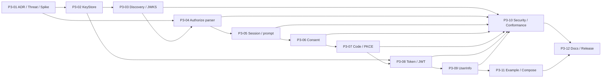

# OneIssuer 第三阶段开发计划：OIDC 主流程

> 状态：Implemented and verified；2026-08-01 Definition of Done 全项通过
> 计划日期：2026-08-01  
> 对应总体方案：[`go-backend-design.md`](./go-backend-design.md) 的“阶段三：OIDC 主流程”  
> 冻结输入：[`phase-3-handoff.md`](./phase-3-handoff.md)（阶段二边界已验收）  
> 前置版本：`v0.1.0-dev.2`  
> 建议版本标识：`v0.1.0-dev.3`  
> 适用范围：单 Issuer、非多租户、自托管部署  
> 初步工作量：单人约 18–25 个有效开发日；在协议库与 KeyStore Spike 后重新估算

## 1. 阶段定位

第二阶段已经完成用户、密码凭证、浏览器 Session、OIDC Client Registry、管理员能力、
审计以及短期授权事务，但还不会返回任何 OAuth/OIDC 成功结果。第三阶段第一次把这些
已经冻结的领域用例连接成可供业务系统接入的最小 OIDC Provider 主流程：

```text
Discovery / JWKS
→ Authorization Endpoint
→ OneIssuer Session 登录或注册
→ Consent
→ Authorization Code + S256 PKCE
→ Token Endpoint
→ ID Token + Access Token
→ UserInfo
```

本阶段以“正确、可互操作、可审计的 Authorization Code Flow”为唯一主线。它不是把
总体方案中的全部 OAuth 生命周期一次做完，也不会为了端点数量提前加入 Refresh Token、
Revoke、Introspection 或 Logout 的占位实现。

本计划中的协议剖面是实施默认值。开工 PR 必须先提交 ADR 与威胁模型；如果评审决定
改变剖面，必须先同步修改本计划、协议矩阵和负向测试，不允许代码静默偏离文档。

## 2. 阶段演示

完成后，开发者应能在空数据库和新生成的测试签名密钥上完成以下演示：

```text
生成本地 RS256 签名密钥
→ docker compose 启动 PostgreSQL 并显式执行 00001–第三阶段最新迁移
→ Bootstrap 管理员并创建两个使用不同 Client ID 的示例 Client
→ 访问 Discovery，确认 Issuer、Authorize、Token、UserInfo、JWKS URL 一致
→ 示例 Client A 发起 prompt=create + state + nonce + S256 PKCE
→ OneIssuer 托管页完成注册、建立 Session、确认 Consent
→ 精确跳回 A，A 使用一次性 Code 和 verifier 换取 Token
→ A 验证 ID Token 的签名、iss、aud、exp、nonce，并调用 UserInfo
→ 同一浏览器访问 Client B，复用 OneIssuer Session 并单独确认 B 的 Consent
→ 错误 Redirect URI、错误 verifier、重复 Code 和禁用 Client 均安全失败
→ 重启 OneIssuer 后 Consent、Code 消费状态和 Access Token 元数据仍然正确
```

示例 Client 必须像真实 Relying Party 一样验证 `state`、`nonce`、Issuer、Audience、签名和
过期时间，不能为了演示直接解码 JWT 或关闭 TLS/Claim 校验。开发环境可以显式使用
loopback HTTP；生产配置仍必须使用 HTTPS。

## 3. 目标与非目标

### 3.1 必须完成

1. 固定 Issuer 的 OIDC Discovery 与只含公钥的 JWKS；
2. 文件型 RS256 KeyStore、密钥生成命令、唯一 `kid`、启动校验和重启式轮换说明；
3. 只支持 `response_type=code` 的 Authorization Endpoint；
4. 对 Public 和 Confidential Client 都强制 S256 PKCE；
5. 复用数据库 Session 的登录、重新认证、`prompt`、`max_age` 和 `prompt=create` 恢复；
6. 服务器托管 Consent 页面和可复用的持久化 Consent Grant；
7. 摘要存储、短时、一次性且并发安全的 Authorization Code；
8. 只支持 Authorization Code Grant 的 Token Endpoint；
9. Public Client 的 `none` 与 Confidential Client 的 `client_secret_basic`；
10. RS256 ID Token、RFC 9068 JWT Access Token 和明确的 Claim/Scope 映射；
11. 仅接受本阶段 Access Token 的 UserInfo Endpoint；
12. 协议错误重定向安全、请求大小边界、隐私日志、固定审计事件和低基数指标；
13. 单元、真实 PostgreSQL 集成、并发、Fuzz、协议负向与适用 Conformance 测试；
14. 可运行的服务端示例 Client、Compose E2E、接入文档和阶段三 Release Notes 模板。

### 3.2 明确不做

以下能力不进入第三阶段 Definition of Done：

- Refresh Token Grant、`offline_access` 签发、Refresh rotation 或 reuse detection；
- Revocation、Introspection、RP-Initiated Logout 或 Front-/Back-Channel Logout；
- Implicit、Hybrid、Client Credentials、Resource Owner Password、Device、Token Exchange；
- Dynamic Client Registration、PAR、JAR、JARM、Request Object 或 Request URI；
- DPoP、mTLS、private-key JWT、`client_secret_post` 或新的 Client 类型；
- 多资源 Audience、Resource Indicators 或通用业务 API 授权模型；
- Pairwise Subject、Organization、Realm、Tenant 或任何隐藏多租户字段；
- Access Token 即时全局撤销、跨节点/分布式限流或完整风控系统；
- 在线自动密钥轮换、热重载、HSM/KMS/Vault 或远程签名；
- Consent/Grant 自助管理中心、账号切换器、MFA、邮箱验证或密码找回；
- 将 `web/` React Mock 变成身份、Session、Consent 或协议状态来源；
- OpenID Foundation 认证声明、FAPI 合规声明或生产就绪声明。

阶段二 Client Registry 已允许登记 `offline_access`，但第三阶段协议端点必须把它视为
尚未启用的 Scope：授权请求返回 `invalid_scope`，Discovery 的 `scopes_supported` 也不
声明它。阶段四实现完整 Refresh Token 生命周期后才能同时开放申请、签发和元数据声明。

## 4. 阶段二冻结边界

第三阶段不得复制或绕过下列已验收契约：

| 边界 | 第三阶段必须复用的行为 |
| --- | --- |
| Identity | `User.Subject` 是稳定外部 `sub`；密码只经 `identity.Service.VerifyLogin` 验证 |
| User 状态 | Disabled User 不能登录；协议流程每个最终授权点重新确认用户仍为 Active |
| Client | 通过 Client 服务/只读模型解析；Disabled Client 不能进入安全错误重定向流程 |
| Client Secret | Confidential 认证复用 `ValidateSecret` 及其通用失败语义 |
| Redirect URI | 复用逐字节精确匹配；不解码后比较、不规范化、不接受前缀、通配符或回退 URI |
| Scope | 必须是 Client 已登记集合的子集；OIDC 请求必须含 `openid` |
| Browser authority | 唯一权威仍是数据库 Session Cookie，不把 OAuth Token 写入 OneIssuer Cookie |
| Recent auth | `session.Principal.AuthenticatedAt` 是 `max_age` 和 `prompt=login` 后 `auth_time` 来源 |
| CSRF | 登录、注册、Consent 等 OneIssuer 状态变更继续使用既有同源和 CSRF 保护 |
| Auth transaction | 浏览器只持有高熵不透明事务值；协议层先完整验证，再调用 `authflow.CreateVerified` |
| Atomicity | 成功授权必须把事务单次消费与 Code 创建放在同一 PostgreSQL 事务中 |
| HTTP | 保留 `X-Request-ID`、安全响应头、可信代理、超时、统一非协议错误和关闭顺序 |
| Audit/metrics | 只增加固定白名单事件和固定低基数标签，不写任意协议参数值 |
| Migration | `00001`–`00005` 校验和保持不变；任何新结构从 `00006` 开始 |
| Deployment | 一个进程、一个 PostgreSQL、一个配置 Issuer；`serve` 不自动迁移 |

阶段二接口当前只保存 `PromptCreate`，且成功路径的 `Consume` 与 Code 签发还未原子绑定。
第三阶段可以通过新接口和 `00006+` 迁移扩展 `authflow`，但不能修改 `00005`，也不能让
OIDC Handler 直接读写 `auth_transactions`、凭证、Secret 或 Session 表。

## 5. 开工前 ADR、威胁模型与依赖 Spike

### 5.1 必须先提交的设计产出

在第一个协议功能 PR 前新增并评审：

- `docs/adr/0002-phase-three-oidc-security-profile.md`；
- `docs/phase-3-threat-model.md`；
- 协议库/JOSE 库 Spike 记录及固定版本、许可证和漏洞扫描结果；
- 适用的 OpenID Provider Conformance 测试清单和暂不适用项理由。

威胁模型至少覆盖浏览器、Client、反向代理、OneIssuer、PostgreSQL、签名密钥文件、示例
Client 和资源调用方之间的信任边界，以及开放重定向、授权请求注入、登录 CSRF、Consent
CSRF、Code interception、PKCE downgrade、Client 认证降级、Code replay、JWT algorithm
confusion、`kid` collision、密钥泄漏、SSRF、日志泄漏和并发竞态。

### 5.2 默认冻结的协议决策

| 主题 | 第三阶段决策 |
| --- | --- |
| Issuer | 单一、配置驱动、区分大小写；首版采用无路径且无尾随 `/` 的 origin 型 URL |
| Flow | 只支持 OIDC Authorization Code Flow，`response_type=code` |
| Response mode | 只支持默认 `query`；显式 `response_mode=query` 等价 |
| Grant | Token Endpoint 只接受 `grant_type=authorization_code` |
| PKCE | 所有 Public/Confidential Client 都必须使用 `S256`，不提供豁免开关 |
| Client auth | Public=`none`；Confidential=`client_secret_basic`；禁止多种方式混用 |
| Scope | 协议支持 `openid profile email`；本阶段拒绝 `offline_access` |
| Prompt | 支持 `none login consent create` 及本计划规定的组合规则 |
| Subject | 只提供 `public` Subject，值为冻结的 `User.Subject` |
| Signing | 只使用 RS256；JWT Header 固定 `alg`、`kid` 和适用的 `typ` |
| ID Token | 5 分钟；Audience 是发起 Client；不保存完整 Token |
| Access Token | 10 分钟 RFC 9068 JWT；Audience 固定为 OneIssuer UserInfo |
| Code | 256-bit 随机不透明值；默认 60 秒；只存领域分离 SHA-256 摘要 |
| Consent | 首次按 User + Client + Scope 持久化；已覆盖 Scope 可复用 |
| Clock skew | 默认 30 秒、最大 2 分钟；只用于时间 Claim 验证，不延长数据库单次消费边界 |
| Key rotation | 文件加载、重启生效、支持新旧公钥重叠；不实现在线自动轮换 |
| Error | Redirect URI 验证前仅显示本地错误；验证后才允许携带原 `state` 安全跳回 |

origin 型 Issuer 的限制会收紧第二阶段“绝对 URL”配置规则。实现时必须更新配置校验和
升级说明：生产使用 HTTPS；开发只允许显式 loopback HTTP；不从 `Host`、Forwarded Header
或请求路径补全 Issuer。未来若支持带路径 Issuer，必须单独设计 Discovery 路径、路由挂载和
反向代理兼容性。

### 5.3 协议库与 JOSE Spike 退出条件

总体方案推荐 Ory Fosite 与 `go-jose`，但当前 `go.mod` 尚未引入二者。Spike 必须用最小
可运行原型确认版本和组合方式，不能仅凭文档假设。退出条件：

1. 标准协议库负责 OAuth/OIDC 请求、错误和 Token 策略中的可复用部分；
2. OneIssuer 通过自有 Adapter 暴露 Client、Session、Consent、Code 和 KeyStore，不把库类型
   扩散到 `identity`、`client`、`session` 等领域包；
3. 能复用 `ValidateSecret`、精确 Redirect URI 和冻结 Scope，而不复制第二套 Client Store；
4. 能在 OneIssuer PostgreSQL 事务中实现 Code 单次消费和 Access Token 元数据提交；
5. 能固定 RS256、校验 `kid`/`typ`/Claim，并拒绝 `none` 或算法降级；
6. 重复参数预检、请求体上限和安全错误重定向可以在进入库前确定；
7. 依赖版本被精确锁定，`govulncheck`、许可证检查和 SBOM 通过。

如果 Fosite 的默认 Storage 或 Token Strategy 无法满足冻结原子性，不得为迁就库而绕过领域
边界。ADR 可以选择只使用其适合的组件并由成熟 JOSE 库签名，但禁止手写 RSA、JWS、JWK
序列化或以测试通过为由接受不符合标准的简化协议。

### 5.4 规范基线

实施和测试至少以以下规范为基线：

- [OpenID Connect Core 1.0](https://openid.net/specs/openid-connect-core-1_0.html)；
- [OpenID Connect Discovery 1.0](https://openid.net/specs/openid-connect-discovery-1_0.html)；
- [OAuth 2.0（RFC 6749）](https://www.rfc-editor.org/rfc/rfc6749)；
- [Bearer Token Usage（RFC 6750）](https://www.rfc-editor.org/rfc/rfc6750)；
- [PKCE（RFC 7636）](https://www.rfc-editor.org/rfc/rfc7636)；
- [JWT/JWS/JWK（RFC 7519/7515/7517）](https://www.rfc-editor.org/rfc/rfc7519)；
- [JWK Thumbprint（RFC 7638）](https://www.rfc-editor.org/rfc/rfc7638)；
- [JWT Profile for Access Tokens（RFC 9068）](https://www.rfc-editor.org/rfc/rfc9068)；
- [OAuth 2.0 Security Best Current Practice（RFC 9700）](https://www.rfc-editor.org/rfc/rfc9700)；
- [Initiating User Registration via OpenID Connect](https://openid.net/specs/openid-connect-prompt-create-1_0.html)。

## 6. 推荐模块与依赖边界

```text
internal/
├── oidc/                    # 协议参数、Fosite Adapter、端点编排和 RFC Error
├── authorization/           # 授权决策、Consent、Code 签发/交换的原子用例
├── consent/                 # Grant 模型、Scope 覆盖与持久化接口
├── token/                   # Claim 构造、JWT 策略、Access Token 元数据
├── keystore/                # 文件加载、Signer、公共 JWKS 与 key ring
├── authflow/                # 扩展已验证请求上下文，不负责解析原始 OIDC 参数
├── identity/                # 复用；不感知 OAuth Handler
├── client/                  # 复用；必要时新增只读解析方法，不改变 Secret 语义
├── session/                 # 复用 Authenticate/AuthenticatedAt/轮换/CSRF
├── audit/                   # 扩展固定协议事件
├── httpserver/              # 路由、托管页、安全头、大小/超时边界
└── storage/postgres/        # sqlc Adapter 与跨表事务实现
```

模块协作原则：

- `oidc` 可以识别标准参数和错误，但不查询密码摘要、Secret 摘要或 Session SQL；
- `authorization` 是“事务 + Grant + Code”和“Code + Token 元数据”的原子边界；
- `consent` 不接受浏览器提交的 Client、Redirect URI 或 Scope，只恢复服务器事务；
- `token` 只接收已经验证的 User/Client/Grant 数据，不自行重新解释请求；
- `keystore` 返回受限 `Signer`/public JWK 视图，调用方永远拿不到可序列化私钥；
- 协议库和 JOSE 库只出现在 Adapter/策略层，领域接口保持库无关；
- 跨模块数据库一致性通过一个明确的 PostgreSQL Repository 方法实现，不在 Handler 中
  手工开始事务或拼 SQL。

## 7. 协议支持矩阵

### 7.1 第三阶段端点

| 方法 | 路径 | 用途 | 鉴权/缓存 |
| --- | --- | --- | --- |
| `GET` | `/.well-known/openid-configuration` | Provider Metadata | 公开，可短时缓存 |
| `GET` | `/oauth2/jwks` | 当前和重叠期公开签名 JWK | 公开，可短时缓存 |
| `GET` | `/oauth2/authorize` | 校验授权请求并进入 Session/Consent 流程 | Browser Session；`no-store` |
| `GET` | `/consent` | 显示服务器恢复的 Consent | Browser Session；`no-store` |
| `POST` | `/consent` | 同意或拒绝授权 | Browser Session + CSRF；`no-store` |
| `POST` | `/oauth2/token` | Code 换取 ID/Access Token | Client 方法；`no-store` |
| `GET`/`POST` | `/oauth2/userinfo` | 返回 Scope 允许的当前 Claims | Bearer Header；`no-store` |

`/login`、`/register` 和现有 Session/管理端点继续存在。Authorization Endpoint 首版只接受
GET；不声明或实现 POST Authorization Request。UserInfo 的 POST 也只从 Authorization
Header 取 Bearer Token，不接受 query 或表单中的 Access Token。

### 7.2 能力矩阵

| 能力 | 第三阶段状态 | 备注 |
| --- | --- | --- |
| Authorization Code | 支持 | 唯一 Response/Grant 主流程 |
| PKCE S256 | 支持且全部 Client 强制 | `plain` 和缺失 challenge 均拒绝 |
| Public Client | 支持 | Token Endpoint method=`none` |
| Confidential Client | 支持 | method=`client_secret_basic`，仍强制 PKCE |
| `state` | 支持 | 原样往返；不记录、不解释 |
| `nonce` | 支持 | 提供时原样放入 ID Token；不记录 |
| `prompt` | `none/login/consent/create` | 见第 10 节组合规则 |
| `max_age` | 支持 | 基于 Session `AuthenticatedAt` |
| `openid/profile/email` | 支持 | Claim 映射固定 |
| `offline_access` | 拒绝 | 阶段四再开放 |
| Refresh Token | 不支持 | Discovery 不声明 |
| Revoke/Introspect/Logout | 不支持 | Discovery 不出现对应 Endpoint |
| `response_mode=query` | 支持 | 其他 mode 返回 `unsupported_response_mode` |
| Pairwise Subject | 不支持 | 只声明 `public` |
| UserInfo JWT response | 不支持 | 只返回 JSON |

## 8. Issuer、Signing Key、JWKS 与 Discovery

### 8.1 Issuer 唯一真值

- Canonical Issuer 只来自 `ONEISSUER_ISSUER`；
- 首版配置必须是 `scheme://host[:port]`，无 userinfo、path、query、fragment 和尾随 `/`；
- Metadata 的 `issuer` 与 ID/Access Token 的 `iss` 必须逐字节相同；
- 所有 Endpoint URL 由 Canonical Issuer 加固定路径生成；
- 不使用请求 `Host`、`X-Forwarded-Host`、`Forwarded` 或示例 Client 输入推导 URL；
- 配置校验先于监听端口和数据库写入，错误时 fail closed。

### 8.2 第三阶段 KeyStore 剖面

文件型 KeyStore 包含：

1. 一个 Active RS256 RSA private JWK，用于新 Token 签名；
2. 零个或多个只含公钥的 Verification JWK，用于轮换前预发布或验证窗口重叠；
3. 由 RFC 7638 SHA-256 JWK Thumbprint 生成或核对的稳定唯一 `kid`。

要求：

- `oneissuer keys generate --alg RS256 --out <private-jwk>` 默认生成 3072-bit RSA，使用安全随机
  源、原子新建、拒绝覆盖，私钥文件权限为 `0600`，命令不向 stdout/stderr 打印私钥；
- Loader 拒绝 RSA 小于 2048 bit、缺少私有参数、非 RS256、重复 `kid`、损坏 JSON、额外
  私钥出现在 verification key set、group/world-readable private file；
- JWKS 输出只允许 `kty`、`use=sig`、`alg=RS256`、`kid`、`n`、`e` 等公开成员；
- 任何 `d`、`p`、`q`、CRT 参数、PEM/JWK 原文、文件内容或私钥路径不进入 HTTP、日志、
  Audit、Metrics、错误详情或 `config check` 输出；
- Active key 缺失或无效时 `serve` 不启动；运行期没有可用 Signer 时 Ready=false 且 Token/
  Authorize 成功路径 fail closed；
- 第三阶段只在启动时加载 key ring，文件变化不热重载；轮换通过受控重启完成。

重启式轮换 Runbook 至少说明：预发布新公钥、等待 JWKS cache 窗口、切换 Active private
key、继续发布旧公钥、等待最长 Token TTL + clock skew + cache 窗口后删除旧公钥。紧急泄漏
时允许移除受影响 Key 并重启，但必须明确这会使尚未过期的相关 JWT 立即无法通过在线 JWKS
验证。在线调度、KMS 和自动撤销留给后续阶段。

### 8.3 JWKS 缓存契约

- JSON 顺序稳定，按 `kid` 排序；
- 返回 `Content-Type: application/json`、固定 `Cache-Control`（建议 `public, max-age=300`）和
  基于公开内容的 ETag；
- 支持条件 GET，`304` 不带 Body；
- 密钥切换测试覆盖 Active + old + pre-published public key；
- JWKS 错误不得回退为临时自签名 key，也不得在启动时静默生成生产密钥。

### 8.4 Discovery 最小准确声明

Discovery 至少返回下列已实现字段：

```json
{
  "issuer": "<configured-issuer>",
  "authorization_endpoint": "<configured-issuer>/oauth2/authorize",
  "token_endpoint": "<configured-issuer>/oauth2/token",
  "userinfo_endpoint": "<configured-issuer>/oauth2/userinfo",
  "jwks_uri": "<configured-issuer>/oauth2/jwks",
  "response_types_supported": ["code"],
  "response_modes_supported": ["query"],
  "grant_types_supported": ["authorization_code"],
  "subject_types_supported": ["public"],
  "id_token_signing_alg_values_supported": ["RS256"],
  "token_endpoint_auth_methods_supported": ["none", "client_secret_basic"],
  "scopes_supported": ["openid", "profile", "email"],
  "code_challenge_methods_supported": ["S256"],
  "prompt_values_supported": ["none", "login", "consent", "create"]
}
```

实现可以增加与实际行为一致的 `claims_supported` 及明确为 `false` 的可选能力标志，但禁止
提前声明 `refresh_token`、`offline_access`、`end_session_endpoint`、`revocation_endpoint`、
`introspection_endpoint`、动态注册、Request Object 或未实现算法。Metadata 应做快照测试，
并与实际路由和 Token Header 做交叉测试，而不是只比较手写 JSON。

P3-03 可以先交付 Metadata builder 及其快照测试，但 Discovery HTTP route 只有在 Authorize、
Token 和 UserInfo 均已实现后才允许启用；主分支任何时刻都不能公开指向 404 或伪成功端点的
Provider Metadata。JWKS 可以在 KeyStore 就绪后独立先行发布。

## 9. Authorization Endpoint 参数与安全错误重定向

### 9.1 解析边界

在创建任何授权事务前按以下顺序处理：

1. 将 request target/query 固定限制为至多 8 KiB，并验证 UTF-8/percent-encoding；
2. 对所有安全相关参数建立出现次数，重复参数一律 `invalid_request`；
3. 解析 `client_id`，通过 Client 服务取得 Active Client；
4. 解析并逐字节匹配必填 `redirect_uri`；
5. 验证 `response_type=code` 和默认/显式 `response_mode=query`；
6. 验证 Scope 是 Client 登记集合子集、包含 `openid` 且不含 `offline_access`；
7. 验证 `code_challenge` 和 `code_challenge_method=S256`；
8. 验证 `state`、`nonce`、`prompt`、`max_age` 的语法、长度和组合；
9. 仅把已验证、最小上下文传入扩展后的 `authflow.CreateVerified`；
10. 浏览器后续步骤只携带服务器生成的不透明事务值。

Authorize 参数剖面：

| 参数 | 规则 |
| --- | --- |
| `client_id` | 必填且恰好一次；只解析已登记 Active Client |
| `redirect_uri` | 必填且恰好一次；与登记字符串逐字节完全相同 |
| `response_type` | 必填，恰好为单值 `code` |
| `response_mode` | 可选，仅 `query` |
| `scope` | 必填；空格分隔、去重后为 `openid/profile/email` 子集，必须含 `openid` |
| `code_challenge` | 必填；S256 输出的 43 字符未填充 base64url |
| `code_challenge_method` | 必填且精确为 `S256`，不进行大小写宽松处理 |
| `state` | 可选，建议 Client 必填；1–1024 bytes，不做业务解释 |
| `nonce` | 可选，建议 OIDC Client 必填；1–1024 bytes，不做业务解释 |
| `prompt` | 可选，空格分隔集合；仅接受第 10 节值和组合 |
| `max_age` | 可选；规范十进制非负整数，最大 30 天，不接受符号、小数或重复值 |

未识别的标准扩展参数按 ADR 固定的协议库策略安全忽略，不能覆盖已解析值；`request`、
`request_uri` 等本阶段明确不支持的参数返回稳定协议错误。解析器不得使用“取第一个”或
“取最后一个”的方式容忍重复安全参数。

### 9.2 Redirect 安全状态机

| 已验证状态 | 响应规则 |
| --- | --- |
| Client 未知、Disabled 或 `client_id` 无效 | OneIssuer 本地 4xx 错误页；绝不外跳 |
| Redirect URI 缺失、无效或不匹配 | OneIssuer 本地 4xx 错误页；绝不外跳 |
| Client + Redirect URI 已可信，后续参数错误 | 可用 query mode 跳回，携带标准 `error` 和原 `state` |
| 用户拒绝 Consent | 单次消费事务后跳回 `error=access_denied` 和原 `state` |
| `prompt=none` 需要交互 | 安全跳回 `login_required`/`consent_required`/`interaction_required` |
| 内部存储或签名故障 | 未签发 Code；使用稳定 `server_error`，不泄露内部原因 |

本地错误页不显示或嵌入 Redirect URI、State、Nonce、PKCE、原始 query 和数据库错误。安全
跳回只往已验证 URI 追加标准参数；如果已登记 URI 自带 query，必须通过 URL 构造器合并，
不能字符串拼接。State 只在协议跳回中逐字节往返，不进入日志、Audit、Metrics 或本地错误
Body。所有浏览器协议页面和重定向响应设置 `Cache-Control: no-store`、
`Referrer-Policy: no-referrer` 和现有严格安全头。

## 10. Session、`prompt`、`max_age` 与注册恢复

### 10.1 Session 决策

Authorization Endpoint 通过 `session.Service.Authenticate` 读取数据库 Session：

- 无有效 Session 时进入既有 `/login`，只传服务器事务值；
- Active Session 且无需重新认证时，进入 Grant 复用或 Consent；
- Session 对应 User 已 Disabled 时按未认证处理，且不能签发 Code；
- 登录/重新认证成功创建新 Session 并撤销旧 Session，使用新 Principal 的
  `AuthenticatedAt`；
- JWT、Authorization Code、State 或 Client 输入都不能替代 OneIssuer Session；
- 在 Code 最终创建前再次检查 User 和 Client 状态，避免页面停留期间状态变化。

### 10.2 `prompt` 组合与行为

| 输入 | 行为 |
| --- | --- |
| 缺失 | 复用有效 Session；复用已覆盖的 Grant，否则交互 |
| `none` | 绝不显示登录/注册/Consent；缺条件时安全返回对应交互错误 |
| `login` | 强制重新输入凭证并轮换 Session；Grant 仍可复用 |
| `consent` | 即使已有覆盖 Grant 也再次展示 Consent |
| `create` | 在全局和 Client 注册策略允许时进入既有托管注册并继续原事务 |
| `login consent` | 先强制登录，再强制 Consent |
| `create consent` | 注册后明确显示 Consent；首次 Grant 本来也不得静默创建 |

`none` 不得与其他值组合；`create` 不得与 `login` 组合；未知值、重复值或其他冲突组合返回
`invalid_request`。当前已有有效 Session 的用户请求 `create` 时安全跳回
`interaction_required`，不静默复用、覆盖、注销或切换现有身份；用户必须先在 OneIssuer
完成显式 Logout，再由 Client 发起新的 `prompt=create` 请求。

### 10.3 `max_age` 与 `auth_time`

- `max_age=0` 等同必须立即重新认证；
- 其他值比较 `now - Principal.AuthenticatedAt`，超出时进入登录；
- `prompt=login` 优先强制登录，即使 `max_age` 尚未过期；
- `prompt=none` 且 Session 不满足 `max_age` 时返回 `login_required`，不显示页面；
- 重新认证后的 `AuthenticatedAt` 成为本次授权 Code 和 ID Token 的 `auth_time`；
- 只允许小范围配置 clock skew 处理 Token 时间验证，不用 skew 延长 Session 或事务 TTL。

### 10.4 `prompt=create` 恢复

注册表单继续复用第二阶段身份、密码、Session 与 CSRF 用例。浏览器 POST 不得再次提交
Client ID、Redirect URI、Scope、State、Nonce 或 PKCE；这些值只能从摘要查找的授权事务
恢复。注册关闭、Client 不允许注册、事务过期或 Client 在过程中被禁用时，流程安全终止且
不形成开放重定向。

## 11. Consent 与 Grant

### 11.1 持久化模型

第三阶段实现服务器端 `consent_grants`，语义为某个 Active User 已向某个 Active Client
授权的 Scope 集合。Grant 不保存 Token、State、Nonce、Redirect URI 或 Client Secret。

建议不变量：

- 每个 `(user_id, client_id)` 最多一个当前 Grant；
- Scope 只允许 `openid/profile/email`，排序、去重并有数据库约束；
- 首次同意创建 Grant；后续同意新 Scope 时做集合并集；
- 请求 Scope 是当前有效 Grant 子集时可以复用；
- Client 管理员缩小允许 Scope 后，有效集合按当前 Client 配置取交集，旧值不能继续签发；
- User/Client Disabled 时 Grant 不可用；
- 用户拒绝本次请求不会静默删除已有 Grant，也不会签发 Code；
- Grant 主动撤销 UI/API 留到阶段四，在此之前不能声称支持撤销 Consent。

### 11.2 Consent 页面

页面内容只能来自服务器恢复的数据：

- 展示已注册并经过 HTML 转义的 Client 名称；
- 展示固定本地化 Scope 名称和清晰的数据含义；
- 区分本次新申请 Scope 与已授予 Scope；
- 不加载 Client 提供的远程脚本、任意 HTML、追踪像素或不受控 Logo；
- POST 只接受事务值、固定 `approve`/`deny` 决策和 CSRF；
- 同意前重新解析 Session，拒绝跨用户、过期、已消费或 Client/User Disabled 的事务；
- Deny 和 Approve 都单次终结当前事务，浏览器刷新/回退不能重复签发 Code。

Grant 更新、授权事务消费、Authorization Code 创建和成功 Audit 必须位于同一数据库事务。
如果其中任一步失败，不返回 Code，也不留下“已同意但未完成”的半状态。

## 12. Authorization Code 与 S256 PKCE

### 12.1 Code 结构与存储

- 使用 CSPRNG 生成 32 bytes（256 bit）随机值，以固定版本前缀和未填充 base64url 编码；
- PostgreSQL 只保存领域分离 SHA-256 摘要并建立唯一索引；
- 默认 TTL 60 秒，最大配置 5 分钟，过期判定不依赖清理任务；
- Code 绑定 Client 内部 ID、User、精确 Redirect URI、Scope、PKCE challenge/method、Nonce、
  `auth_time`、授权事务和 Consent Grant；
- Code 不包含自描述业务数据，不以 JWT 形式签发；
- clear Code 只存在于成功重定向构造和短期内存，不写数据库、日志、Audit 或 Metrics。

### 12.2 PKCE 规则

- Authorize 必须同时提供 `code_challenge` 与 `code_challenge_method=S256`；
- challenge 必须是 SHA-256 输出的 43 字符未填充 base64url；
- Token 请求的 `code_verifier` 必须为 43–128 个 RFC 7636 unreserved ASCII 字符；
- 服务器计算 `BASE64URL-NOPAD(SHA256(ASCII(code_verifier)))` 后常量时间比较；
- 不接受 `plain`、空 verifier、Unicode、padding、宽松 base64、大小写变化或自动 trim；
- Public 和 Confidential Client 使用同一规则，不提供 per-Client 关闭开关。

### 12.3 授权成功原子流程

```text
恢复未过期、未消费的服务器授权事务
→ Authenticate 当前 Session 并确认 User Active
→ 重新读取 Client，确认 Active、URI 与 Scope 仍有效
→ 确认 Consent 决策或可复用 Grant
→ 生成 clear Code 和摘要
→ BEGIN
   → 条件锁定/消费 auth_transaction
   → upsert Consent Grant（若本次有交互同意）
   → INSERT authorization_code 摘要及全部绑定上下文
   → INSERT 固定授权成功 Audit
→ COMMIT
→ 仅在 Commit 成功后 302/303 到已验证 Redirect URI?code=...&state=...
```

并发提交、双击、刷新或两个进程同时批准同一事务时最多一个 Commit 成功。数据库条件更新
是权威，不使用进程内 mutex 代替。HTTP 连接在 Commit 后断开会导致 Client 未收到 Code，
但绝不能回滚为可重复签发；这是网络层 at-most-once 交付限制，接入文档必须说明重新发起
完整授权请求，而不是重放事务。

## 13. Token Endpoint 与 Client 认证

### 13.1 HTTP 和参数边界

- 只接受 `POST` 与 `application/x-www-form-urlencoded`；拒绝 JSON、multipart 和错误方法；
- 在解析前使用 `MaxBytesReader` 等机制设置固定小上限，建议 8 KiB；
- `grant_type`、`code`、`redirect_uri`、`code_verifier`、`client_id` 等安全参数不得重复；
- `grant_type` 只接受 `authorization_code`；Refresh 请求返回 `unsupported_grant_type`；
- `redirect_uri` 必填，且必须与 Code 绑定字符串逐字节相同；
- 未识别扩展参数按 RFC/协议库策略忽略，但不能改变已验证参数；
- 所有响应带 `X-Request-ID`；成功和错误都设置 `Cache-Control: no-store` 与
  `Pragma: no-cache`。

### 13.2 Client Authentication

Confidential Client：

- 只接受一个 RFC 6749 `Authorization: Basic ...` Header；
- 严格解析 base64 和 form-encoded Client ID/Secret，拒绝 malformed、重复 Header、空值和
  Header/body 多通道认证；
- 通过 Client 服务确认 `client_secret_basic` 并调用 `ValidateSecret`；
- 未知 Client、错误 Secret、Disabled Client、错误 auth method 使用统一 `invalid_client`；
- 适用时返回 HTTP 401 和固定 `WWW-Authenticate: Basic`，不区分失败原因。

Public Client：

- 必须在 form body 中提供唯一 `client_id`；
- 不得提供 Authorization Header 或 `client_secret`；
- Registry auth method 必须为 `none`，且仍必须验证 Code 绑定和 PKCE；
- Public Client 身份不是秘密，不能把 `client_id` 检查当作认证。

Token Handler 不直接读取 Secret Hash，也不记录 Authorization Header、Client ID、Code、
verifier 或 Token。完整自适应/分布式限流延期，但本阶段至少实现请求大小、超时、数据库
语句超时、全局并发上限以及可由反向代理执行的部署建议。

### 13.3 Code 交换与 Token 提交

```text
严格解析 form 和唯一认证通道
→ 认证/解析 Client
→ 计算 Code 摘要
→ BEGIN
   → SELECT/条件锁定未消费、未过期 Code
   → 统一验证 Client、Redirect URI、PKCE、User/Client Active
   → 构造固定 Claim，并由本地 KeyStore 完成有界 RS256 签名
   → INSERT Access Token jti 摘要和生命周期元数据
   → 条件标记 Code consumed_at
   → INSERT 固定 Code 交换/Token 签发 Audit
→ COMMIT
→ 仅在 Commit 后写 no-store JSON Token Response
```

签名失败、数据库失败或 Audit 失败必须 Rollback，使 Code 保持未消费；两个并发交换最多一个
成功。签名发生在持锁事务中只因为第三阶段 Signer 是本地内存 RSA 且操作有界；引入远程
KMS 前必须重新设计，不能在数据库事务内执行无界网络调用。

Commit 后响应连接中断时 Code 仍然已消费，服务不提供 Token Response 重放缓存。成功响应
包含 `access_token`、`token_type=Bearer`、`expires_in`、`id_token` 和实际授予的 `scope`，
绝不包含 `refresh_token`。

## 14. ID Token、Access Token、Claim 与 Scope

### 14.1 Token 类型与生命周期

| 类型 | 格式 | 默认 TTL | 持久化 |
| --- | --- | --- | --- |
| Authorization Code | 256-bit 随机不透明值 | 60 秒 | 只存摘要、绑定和消费状态 |
| ID Token | RS256 JWS/JWT | 5 分钟 | 不保存完整 Token |
| Access Token | RFC 9068 RS256 JWT | 10 分钟 | 不保存完整 Token；保存 `jti` 摘要和授权元数据 |

JWT Header：

- ID Token：`alg=RS256`、唯一 `kid`、`typ=JWT`；
- Access Token：`alg=RS256`、唯一 `kid`、`typ=at+jwt`；
- 验证端按 allow-list 同时校验 alg、kid、kty、use 和 typ，禁止根据 Token Header 选择任意
  算法、文件或 URL；不解析 `jku`、`x5u` 等远程 Key 引用。

### 14.2 ID Token Claim

| Claim | 值/规则 |
| --- | --- |
| `iss` | Canonical configured Issuer，逐字节一致 |
| `sub` | 冻结的 `User.Subject`，不是 UUID、用户名或邮箱 |
| `aud` | 单个发起 Client 的公开 `client_id` |
| `azp` | 固定为发起 `client_id`；阶段三不产生多 Audience |
| `exp` / `iat` | 使用注入 Clock 的 UTC 秒；TTL 按配置上限 |
| `auth_time` | 产生本次授权的 Session `AuthenticatedAt` |
| `nonce` | Authorize 提供时逐字节返回；未提供时省略 |
| `name` | 授予 `profile` 时使用 `DisplayName` |
| `preferred_username` | 授予 `profile` 时使用展示 `Username` |
| `email` / `email_verified` | 授予 `email` 时使用当前领域值 |

不输出内部 User UUID、Role、Admin 状态、规范化字段、密码/Session 数据、IP、User-Agent、
Client Secret 或任意审计 ID。`email_verified=false` 必须如实返回，不能因 Client 请求而改为
true。

### 14.3 Access Token Claim

| Claim | 值/规则 |
| --- | --- |
| `iss` | Canonical configured Issuer |
| `sub` | `User.Subject` |
| `aud` | 固定 UserInfo Endpoint URL |
| `client_id` | 发起 Client 的公开 `client_id` |
| `scope` | 排序后的实际授权 Scope，以空格连接 |
| `iat` / `exp` | 默认 10 分钟有效期 |
| `jti` | 每个 Token 独立的 128-bit 以上随机标识；数据库只存领域分离摘要 |

第三阶段 Access Token 只面向 OneIssuer UserInfo，不是任意业务 API 的通用凭证。业务资源
Audience、权限 Claim 和离线验证撤销延迟必须在后续 ADR 中设计；示例 Client 不应把该 Token
发送给其他资源服务器。

### 14.4 Scope 到 Claim 的固定映射

| Scope | 可返回 Claim |
| --- | --- |
| `openid` | `sub` 及必需协议 Claim |
| `profile` | `name`、`preferred_username` |
| `email` | `email`、`email_verified` |

ID Token 是签发时快照；UserInfo 返回调用时的当前资料，但仍受原 Access Token Scope 限制。
任何新增 Scope/Claim 都需要 Client Registry 变更、ADR、Discovery 更新、Consent 文案和正负测试。

## 15. UserInfo 与 Access Token 生命周期

### 15.1 Bearer 验证

UserInfo 只接受单个 `Authorization: Bearer <access-token>`：

1. 拒绝 query/body Token、多个 Authorization Header 和错误 Scheme；
2. 只允许 RS256、已发布且受信任的 `kid`、`typ=at+jwt`；
3. 校验签名、`iss`、固定 UserInfo `aud`、`iat`、`exp`、`jti`、`client_id` 和 Scope；
4. 以 `jti` 领域分离摘要查询已提交且未过期的 Access Token 元数据；
5. 确认绑定的 User 与 Client 仍为 Active，Subject/Client/Scope 与元数据一致；
6. 按 Scope 从 Identity 只读模型映射 Claim，返回 `application/json` 和 `no-store`。

成功响应必须始终包含与对应 ID Token 完全相同的 `sub`，再按 `profile`/`email` Scope 增加
可选 Claim。

无效、过期、未知、篡改、错误 Audience、Disabled User/Client 或元数据不一致统一按 RFC 6750
返回 `invalid_token` 与固定 `WWW-Authenticate: Bearer`，不说明具体原因。Scope 不足使用
`insufficient_scope`，但 Header 不回显具体用户、Client 或 Token 内容。

### 15.2 本阶段生命周期语义

- Access Token 元数据是 UserInfo 接受 Token 的必要条件，不是阶段四占位表；
- User/Client Disabled 后 UserInfo 立即拒绝，Code 交换也重新检查状态；
- 浏览器普通 Logout/Session revoke 不承诺即时撤销已签发 Access Token；其最长剩余时间由
  10 分钟 TTL 限制，并在安全说明中作为残余风险记录；
- 不提供外部 Revoke/Introspection，也不接受 Refresh；
- 清理任务只删除超过保留窗口的 expired/terminal Code 与 Access Token 元数据；
- 过期判断在读取路径即时执行，绝不依赖清理任务是否按时运行。

## 16. 数据库迁移顺序

`00001`–`00005` 已进入 checksum 清单，禁止编辑。建议第三阶段按下列顺序新增，最终文件名在
Schema ADR 中冻结：

| 迁移 | 建议内容 | 关键约束 |
| --- | --- | --- |
| `00006_phase_three_protocol_events.sql` | 扩展 Audit event/target/changed-field 白名单 | 仍为固定 CHECK，不接受任意 event 字符串 |
| `00007_auth_transaction_protocol_context.sql` | 增加 response type/mode、prompt set、max_age 等已验证上下文 | local/authorization 两类约束、长度和组合约束 |
| `00008_consent_grants.sql` | User + Client 的持久化 Scope Grant | 唯一键、Scope 数组边界、FK RESTRICT |
| `00009_authorization_codes.sql` | Code 摘要、绑定、TTL、单次消费 | 32-byte hash、唯一、条件消费索引 |
| `00010_access_tokens.sql` | jti 摘要、User/Client/Grant/Scope/时间元数据 | 不保存 JWT；UserInfo 查询与清理索引 |

实施前需画出精确 ERD，并决定 Consent Scope 使用受约束数组还是子表；不能同时维护两份真值。
所有时间使用 `timestamptz`/UTC，所有摘要固定长度并做领域分离，Scope 排序去重，外键删除采用
显式 RESTRICT。表中不得出现 `tenant_id`、私钥、clear Code/Token、Client Secret 或密码。

每个迁移必须：

- 支持空库从 `00001` 顺序 Up；
- 在测试库验证 Down/Up，但生产升级仍以 forward-only 为主；
- 更新 sqlc、生成代码漂移检查和 `migrations/checksums.sha256`；
- 证明从真实 `v0.1.0-dev.2` 数据升级不丢失 Session/Client/Auth Transaction；
- 在多进程并发 Code/Consent/Token 测试中依赖数据库约束而非进程状态；
- 更新备份、恢复、保留和清理文档。

## 17. 配置与 CLI

### 17.1 建议新增配置

| 变量 | 默认/要求 | 安全边界 |
| --- | --- | --- |
| `ONEISSUER_SIGNING_KEY_FILE` | `serve`/`config check` 必填 | Active private JWK；输出必须脱敏 |
| `ONEISSUER_VERIFICATION_KEYS_FILE` | 可选 | 只含 public JWK 的 JWKS；唯一 `kid` |
| `ONEISSUER_AUTHORIZATION_CODE_TTL` | `1m` | 30 秒–5 分钟 |
| `ONEISSUER_ID_TOKEN_TTL` | `5m` | 1–15 分钟 |
| `ONEISSUER_ACCESS_TOKEN_TTL` | `10m` | 1–30 分钟 |
| `ONEISSUER_OIDC_CLOCK_SKEW` | `30s` | 0–2 分钟 |

请求体/参数最大长度、支持算法、Endpoint path、Scope/Claim 映射和 PKCE Policy 使用编译期固定
安全常量，不增加可误配开关。`ONEISSUER_ISSUER` 同时收紧为 origin 型 Canonical URL。

配置 Scope：

- `serve` 和完整 `config check` 必须读取并验证 key ring；
- `migrate *` 不要求签名密钥；
- `admin bootstrap` 继续只要求其既有范围，不因协议配置而失效；
- `keys generate/public` 不连接数据库，也不加载无关服务配置；
- `SafeMap` 只显示 Key 是否 configured/valid 和公开 `kid` 数量；不显示私钥路径或内容。

### 17.2 建议 CLI

```text
oneissuer keys generate --alg RS256 --out <private-jwk>
oneissuer keys public --in <private-jwk> --out <public-jwks>
```

`generate` 必须拒绝 stdout 私钥输出、已有目标文件、符号链接绕过和宽松权限；失败时删除临时
文件。`public` 只输出公开成员，可安全用于预发布/旧 Key overlap。轮换仍由 Runbook 和重启驱动，
不加入容易被误认为在线轮换的空命令。

## 18. 审计、隐私、日志与指标

### 18.1 数据分类

| 数据 | 可进入数据库 | 可进入一般日志/Audit/指标标签 | 可进入协议响应 |
| --- | --- | --- | --- |
| Signing private key | 仅挂载文件，不进普通 DB | 否 | 否 |
| Client Secret/Authorization Header | 仅 Secret 摘要 | 否 | 仅创建/轮换原有一次性响应 |
| Auth transaction clear value | 仅摘要 | 否 | 仅同源浏览器流程 |
| State/Nonce/PKCE challenge | 授权上下文可存 | 否 | 仅标准流程需要的位置 |
| Code/verifier | Code 仅摘要；verifier 不存 | 否 | Code 仅回调；verifier 仅请求 |
| ID/Access Token | 不保存完整值 | 否 | 仅 Token Endpoint 成功响应 |
| `jti` | 只存领域分离摘要 | 否 | JWT Claim |
| User `sub`/Client ID/Scope | 必要业务表可存 | 不作日志值或指标标签 | 按协议最小返回 |
| Request ID | 可存 | 可 | `X-Request-ID` |

日志脱敏器和敏感示例扫描必须扩展到 Code 前缀、Bearer/JWT、Basic Authorization、State、
Nonce、PKCE 和 Token JSON 字段。测试使用合成 canary，断言访问日志、结构化错误、panic、
Audit、Metrics 和 Compose log 均没有 clear 值。

### 18.2 建议固定审计事件

最终名称由 ADR 和数据库 CHECK 同时冻结，至少覆盖：

- `authorization_granted`、`authorization_denied`；
- `authorization_code_issued`、`authorization_code_exchange_succeeded`；
- `authorization_code_exchange_rejected`（只记录受限安全分类，避免攻击流量无限放大）；
- `consent_grant_created`、`consent_grant_expanded`；
- `access_token_issued`；
- `signing_key_loaded` 或等价的启动安全事件。

事件只使用内部 actor/target ID、固定 result、Request ID 和无值 changed-field。不得记录 URI、
Scope 列表、Client ID 字符串、Subject、State、Nonce、Code、Token、verifier、challenge、Secret、
JWT Claim 或 `kid` 值。对所有 malformed 请求逐条写数据库 Audit 可能形成存储 DoS；此类流量以
低基数 Metrics/受限日志计数，只有有意义的状态转换和受控重放分类进入 Audit。

### 18.3 指标

建议新增：

- Authorize request/result；
- Consent decision/result；
- Code issue/exchange result；
- Token issuance type/result；
- UserInfo result；
- KeyStore readiness/load result。

Label 只允许固定的 endpoint/operation/result/error_class/token_type 等枚举。禁止 User ID、Subject、
Client ID、URI、Scope、`kid`、`jti`、Request ID、IP 或任意原始错误字符串。

## 19. 测试策略

### 19.1 单元与表驱动测试

- Issuer canonicalization 与从配置生成 Endpoint URL；
- Discovery 的准确能力、稳定 JSON 和未实现字段缺失；
- private JWK 校验、RFC 7638 `kid`、公钥剥离、重复 Key 和错误权限；
- Authorize percent-encoding、重复参数、长度、response type/mode、Scope 和 Redirect URI；
- `prompt` 组合、`max_age` 边界和 `AuthenticatedAt`；
- S256 challenge/verifier 的正确、错误、Unicode、padding、大小写和长度；
- Consent Scope 覆盖、扩展、Client 缩减和 User/Client Disabled；
- OAuth/OIDC error 到本地/安全 Redirect 的状态机；
- Basic Auth 严格解析、form 解码、认证通道降级与通用失败；
- ID/Access Token Header、Claim、Scope 映射、Clock skew、Audience 和算法 allow-list；
- UserInfo Bearer 错误、Scope 不足和 Claim 最小化；
- 日志/Audit/Metric 标签白名单和敏感 canary 脱敏。

时间、随机数和 Signer 必须可注入。确定性测试 Key 只能存在测试 fixture，必须显著标记且绝不
进入 Compose/生产示例；生产路径永远使用 CSPRNG。

### 19.2 PostgreSQL 集成与并发测试

使用 Testcontainers 真实 PostgreSQL 覆盖：

1. `00001` 到第三阶段最新迁移的空库 Up、重复 Up、测试 Down/Up；
2. 从带阶段二 User/Session/Client/Auth Transaction 的 `v0.1.0-dev.2` 升级；
3. Public 与 Confidential 的完整 Authorization Code + PKCE；
4. 首次 Consent、复用、`prompt=consent`、拒绝和 Scope 扩展；
5. `prompt=create` 注册恢复以及 A 登录后 B 的 SSO；
6. 同一授权事务并发 Approve 只有一个 Code；
7. 同一 Code 并发交换只有一个 Token Response Commit；
8. 错误 Client、Redirect URI、verifier、过期/已消费 Code 都不产生 Token 元数据；
9. User/Client 在页面停留或 Code 交换前被 Disabled 时 fail closed；
10. 重启后 Grant、Code 消费和 Access Token 元数据保持权威；
11. 清理任务取消、数据库超时和 Shutdown 顺序不造成半提交；
12. 签名失败/Audit 失败/Commit 失败时 Code 消费正确 Rollback。

### 19.3 HTTP、Fuzz 与安全负向测试

- Fuzz query/form parser、percent-encoding、Basic Auth、PKCE、JWT/JWK 和 Redirect 构造；
- 错误/缺失 Content-Type、oversized body/query、重复 Header/参数、未知算法和恶意 `kid`；
- 未验证 URI 绝不产生外部 `Location`；已验证 URI 不被 CRLF、fragment 或 query 注入；
- `none`、HS256、错误 Key type、错误 `typ`、过期/未来时间和错误 Audience 全拒绝；
- Code、Token、State、Nonce、verifier、challenge、Basic、Cookie 不出现在响应错误、日志或 Audit；
- `go test -race ./...` 覆盖 KeyStore 并发读取、Approve、Code exchange 和 UserInfo；
- `go vet`、golangci-lint、govulncheck、Fuzz smoke、Trivy、SBOM、生成代码和迁移 checksum 通过；
- Hosted Login/Consent 的 CSP、frame protection、CSRF、Origin/Referer、HTML 转义和可访问性不回归。

### 19.4 Conformance 计划

- 固定 OpenID Foundation Conformance Suite 版本或容器 digest；
- 使用预登记 Client，选择只适用于 Basic OP / Code Flow / static registration 的测试；
- 将不支持 Refresh、Logout、Dynamic Registration、Request Object 等项目明确标为不适用；
- 把执行配置、原始结果位置、失败分析和复测日期记录在阶段三 Release Notes；
- 第三阶段不得声称获得认证；适用测试失败必须修复或形成阻断性已知问题，不能通过扩大
  Discovery 声明绕过。

## 20. 示例 Client、Compose、CI 与文档

### 20.1 示例 Client

新增一个最小服务端 Relying Party 示例，可用两组配置运行成 A/B：

- 自己生成并服务器端保存 state、nonce、PKCE verifier；
- 使用 Discovery 找到端点，按 JWKS 验证 ID Token；
- 严格校验 state、nonce、iss、aud、azp、alg、kid、iat、exp；
- Token 交换使用 S256 和对应 Client auth method；
- 只把 Access Token 发给 Discovery 声明的 UserInfo；
- 用 `(iss, sub)` 作为模拟 JIT 主键，不用 email 关联；
- Cookie/Session 有安全属性，不把 Token 打印到页面、日志或浏览器 localStorage；
- 明确标记为互操作示例而非生产 SDK。

### 20.2 Compose 与验收环境

- 保留独立 one-shot `migrate` 服务；
- private JWK 通过本地挂载/Compose Secret 注入，不 COPY 进镜像；
- 本地生成文件和测试 Client Secret 不提交 Git；
- OneIssuer、A、B 和 PostgreSQL 默认只绑定 loopback；
- Ready 同时反映数据库迁移兼容和有效 Active signing key；
- Compose smoke 从空卷执行迁移、Bootstrap、Client 准备、协议流程、重启和隐私扫描；
- Runtime 继续 non-root、只读可行、最小镜像并通过 Trivy。

### 20.3 CI 与文档

CI 增加协议矩阵快照、真实 PostgreSQL E2E、并发 Code、Key 权限/JWKS、JWT 负向、敏感值扫描
和适用 Conformance job（可分为必跑快速集与受控完整集）。所有工具/Action/镜像固定版本或
digest。

交付时更新：

- `README.md`：只有验收后才把阶段三能力改为 implemented；
- `docs/configuration.md`：Issuer 收紧、Key、TTL、clock skew；
- `docs/migrations.md`：`00006+`、升级和清理；
- `docs/operations.md`：Key 生成、备份、轮换、紧急撤销；
- `docs/troubleshooting.md`：Discovery/JWKS、invalid_client/grant、clock skew；
- 新增 OIDC Client 接入指南和阶段三 Release Notes；
- `api/openapi.yaml` 继续只作为 OneIssuer 管理/当前用户 JSON API 契约；标准协议端点以
  Discovery、规范和协议测试为真值，避免维护一份不完整 OAuth OpenAPI 副本。

## 21. 工作项拆分

| ID | 工作项 | 主要产出 | 前置 | 建议工作量 |
| --- | --- | --- | --- | --- |
| `P3-01` | ADR、威胁模型与依赖 Spike | 安全剖面、Fosite/JOSE 版本、Conformance 矩阵 | 阶段二验收 | 1.5–2 天 |
| `P3-02` | KeyStore、CLI 与配置 | RS256 文件加载、generate/public、readiness、轮换文档 | P3-01 | 1.5–2 天 |
| `P3-03` | Metadata builder 与 JWKS | 精确 Metadata 快照、公开 JWK、缓存/ETag；暂不启用 Discovery route | P3-02 | 1–1.5 天 |
| `P3-04` | Authorize 解析与事务扩展 | `00006/00007`、严格参数、错误重定向 | P3-01、P3-03 | 1.5–2 天 |
| `P3-05` | Session、prompt 与注册恢复 | login/max_age/create/none 状态机 | P3-04 | 1–1.5 天 |
| `P3-06` | Consent Grant 与页面 | `00008`、Grant 复用、CSRF、Approve/Deny | P3-05 | 1.5–2 天 |
| `P3-07` | Code 与 PKCE | `00009`、摘要、S256、原子签发/并发测试 | P3-06 | 1.5–2 天 |
| `P3-08` | Token 与 JWT | `00010`、Client auth、原子交换、ID/Access Token | P3-02、P3-07 | 2–3 天 |
| `P3-09` | UserInfo 与 Token 元数据 | Bearer 验证、状态复核、Claim/Scope | P3-08 | 1–1.5 天 |
| `P3-10` | 协议安全与 Conformance | Fuzz、负向、race、适用 OP Suite | P3-03–P3-09 | 2–3 天 |
| `P3-11` | 示例 Client 与 Compose E2E | A/B RP、完整注册/SSO/重启演示 | P3-09 | 1.5–2 天 |
| `P3-12` | 运维、接入与 Release 文档 | Key Runbook、升级、排障、Release Notes | P3-10、P3-11 | 1–1.5 天 |

验收结论（2026-08-01）：`P3-01`–`P3-12` 已全部实现并通过最终仓库级门禁；命令、
结果和限制记录在 [`phase-3-release-notes.md`](./phase-3-release-notes.md)。

工作量不包含等待外部安全审阅、公开部署 Conformance 环境和发现重大协议库不适配后的重构。
P3-01 结束时必须更新剩余估算。

### 21.1 依赖关系



## 22. 建议 PR 顺序

1. `docs/phase-3-security-profile`：ADR、威胁模型、依赖 Spike、规范/Conformance 矩阵；
2. `feat/oidc-keystore`：KeyStore、CLI、配置、Ready 与轮换测试；
3. `feat/oidc-discovery-jwks`：准确 Metadata builder、JWKS、缓存；暂不公开 Discovery route；
4. `feat/oidc-authorize-request`：Audit/context 迁移、严格解析、事务创建和错误重定向；
5. `feat/oidc-session-policy`：Session、prompt、max_age、login/register continuation；
6. `feat/oidc-consent`：Grant migration/use case、托管页面、CSRF；
7. `feat/oidc-authorization-code`：Code migration、PKCE、原子 Approve/Deny；
8. `feat/oidc-token-endpoint`：Client auth、Code exchange、JWT 与 Access metadata；
9. `feat/oidc-userinfo`：Bearer、Claim/Scope、状态复核，并在全部声明端点可用后启用 Discovery；
10. `test/oidc-security-conformance`：并发、Fuzz、负向、隐私和 Suite；
11. `feat/example-oidc-client`：A/B 示例和 Compose E2E；
12. `docs/phase-3-operations-release`：配置、迁移、Key Runbook、接入、排障和 Release Notes。

每个 PR 必须包含对应迁移/测试/文档，且 Discovery 只能在端点真正实现后增加声明。不能先合并
返回固定成功 Code/Token 的占位 Handler，也不能用内存 Store 绕开 PostgreSQL 并发语义。

## 23. Definition of Done

以下全部满足后，第三阶段才可标记 Implemented and verified：

- [x] 阶段三 ADR、威胁模型、协议库 Spike 和适用 Conformance 矩阵已评审；
- [x] `00001`–`00005` checksum 未变化，`00006+` 空库和阶段二升级测试通过；
- [x] Canonical Issuer、Discovery、JWKS、ID Token 和 Access Token `iss` 完全一致；
- [x] 无有效 Active signing key 时启动/Ready fail closed，private JWK 未进入镜像、日志或响应；
- [x] JWKS 只含公开成员，唯一 `kid`、缓存、预发布和旧 Key overlap 测试通过；
- [x] Discovery 只声明本阶段真实实现的 Response/Grant/Scope/Endpoint/算法；
- [x] Authorize 严格拒绝重复参数、错误 Client、非精确 Redirect URI 和不支持 response mode；
- [x] Public/Confidential Client 都强制 S256，`plain`、缺失和错误 verifier 被拒绝；
- [x] Session、`prompt=none/login/consent/create`、`max_age` 和 `auth_time` 语义有正负测试；
- [x] 注册只能恢复服务器授权事务，不能接受浏览器提供的任意回跳或协议上下文；
- [x] Consent 首次、复用、扩展、强制提示和拒绝语义通过，页面有 CSRF/CSP/转义保护；
- [x] 授权事务消费、Grant 更新和 Code 创建原子；并发批准最多一个 Code；
- [x] Code 只存摘要、短 TTL、一次性；并发交换最多一个成功 Token Response；
- [x] Token Endpoint 只接受 form Code Grant，Client auth 无降级/枚举/重复通道；
- [x] ID Token Header/Claim、Scope 映射、nonce、Audience 和时钟边界符合冻结剖面；
- [x] RFC 9068 Access Token 只面向 UserInfo，元数据是 UserInfo 接受条件；
- [x] UserInfo 校验签名/Issuer/Audience/状态/Scope，不泄露内部 User/Admin 字段；
- [x] Token Response 没有 Refresh Token，`offline_access` 被拒绝且 Discovery 未声明；
- [x] Redirect URI 未验证前没有外跳；验证后的 OAuth/OIDC Error 和 State 往返正确；
- [x] private key、Secret、Cookie、State、Nonce、PKCE、Code、verifier、JWT 不在日志/Audit/指标；
- [x] 新增 Audit 仍是固定白名单，Metrics 没有高基数或用户可控 Label；
- [x] 数据库故障、签名故障、Audit 故障、Client/User 中途禁用均 fail closed 且无半状态；
- [x] `go test -race ./...`、Vet、lint、govulncheck、Fuzz smoke、Trivy、SBOM 和生成检查通过；
- [x] 适用 OpenID Conformance 测试通过并保存版本、配置和结果；不作认证声明；
- [x] 示例 Client A/B 完成注册、Consent、Code、Token、UserInfo 和 SSO 演示；
- [x] Compose 从空卷启动、显式迁移、重启持久性、Key 挂载和隐私扫描通过；
- [x] README、配置、迁移、运维、排障、接入和阶段三 Release Notes 与实现一致；
- [x] Refresh、Revoke、Introspection、RP Logout 等阶段四能力没有伪成功或错误 Metadata 声明。

## 24. 阶段验收脚本草案

最终应提供一个类似 `make phase-3-smoke` 的自动化入口。人工准备流程草案：

```bash
cp .env.example .env

docker compose -f deploy/docker-compose.yml build migrate oneissuer example-client

# 生成本地测试 Key；文件必须被 .gitignore，且不复用于生产。
docker compose -f deploy/docker-compose.yml run --rm --no-deps oneissuer \
  keys generate --alg RS256 --out /run/oneissuer-dev/signing-key.jwk

docker compose -f deploy/docker-compose.yml up -d postgres
docker compose -f deploy/docker-compose.yml run --rm migrate

# 交互式隐藏输入 Bootstrap；随后以受控管理流程创建 A/B Client。
docker compose -f deploy/docker-compose.yml run --rm --no-deps oneissuer \
  admin bootstrap --username admin --email admin@example.invalid

docker compose -f deploy/docker-compose.yml up -d oneissuer client-a client-b

curl --fail --silent --show-error \
  http://localhost:8080/.well-known/openid-configuration
curl --fail --silent --show-error \
  http://localhost:8080/oauth2/jwks
```

自动化脚本还必须完成并断言：

1. Discovery URL、Issuer、JWKS 和实际路由/算法一致；
2. JWKS 不含任何 private JWK 成员；
3. A 的 `prompt=create` 注册恢复、Consent、Code exchange、ID Token 和 UserInfo 成功；
4. B 复用 Session，但必须有自己独立的 Consent 和 Audience；
5. Public/Confidential 两种 Client 均用 S256 完成流程；
6. 错误/未登记 Redirect URI 不外跳；错误 State 由 Client 拒绝；
7. 缺失/错误 verifier、错误 Secret、Code 过期和重复交换失败且不泄露原因；
8. 同一 Code 并发提交只产生一组已提交 Token 元数据；
9. `prompt=none` 在缺 Session/Grant 时返回正确交互错误；
10. Disabled User/Client 不能完成新的授权、交换或 UserInfo；
11. 请求 `offline_access` 或 Refresh Grant 被拒绝，响应中从不出现 Refresh Token；
12. 重启后已消费 Code 仍不可用，Grant 可按规则复用，签名 Key/Issuer 不漂移；
13. 容器日志、Audit、Metrics 和错误响应不含注入的敏感 canary；
14. 第一/二阶段 Bootstrap、管理 API、Session 撤销、Ready 和优雅关闭无回归。

脚本不得把管理员密码、Client Secret、private JWK、Code 或 Token 放在命令行、固定文件、CI
日志或测试报告。自动化需要这些值时，使用临时受限文件/pipe/内存并在退出时清理。

## 25. 进入第四阶段的交接条件

第三阶段验收后，向 Refresh/Revocation/Logout 生命周期交接时必须冻结：

1. Canonical Issuer、Endpoint path、Discovery 生成和 Metadata 准确性；
2. KeyStore/Signer/public JWKS 接口、RS256 `kid` 和重启式 overlap 语义；
3. Authorize 参数、错误重定向、Session/prompt/max_age 和 Consent 决策状态机；
4. Consent Grant 主键、Scope 集合与复用规则；
5. Authorization Code 摘要、绑定、TTL 和原子单次交换接口；
6. Token Endpoint Client auth、请求解析、错误和 no-store 契约；
7. ID/Access Token Header、Claim、Audience、TTL 和 clock-skew 规则；
8. Access Token 元数据与 UserInfo 验证接口；
9. 协议 Audit、隐私分类、Metrics 标签和 Conformance 基线；
10. Public/Confidential 示例 Client 的互操作证据。

第四阶段在这些边界上增加 Refresh Token rotation/reuse detection、Revoke、Introspection、
RP-Initiated Logout、Grant 撤销管理、更完整限流/故障安全和必要的自动 Key 生命周期。它不得
通过改变第三阶段 Code、Subject、Issuer、Redirect URI 或 Secret 语义来“简化”新增流程。
